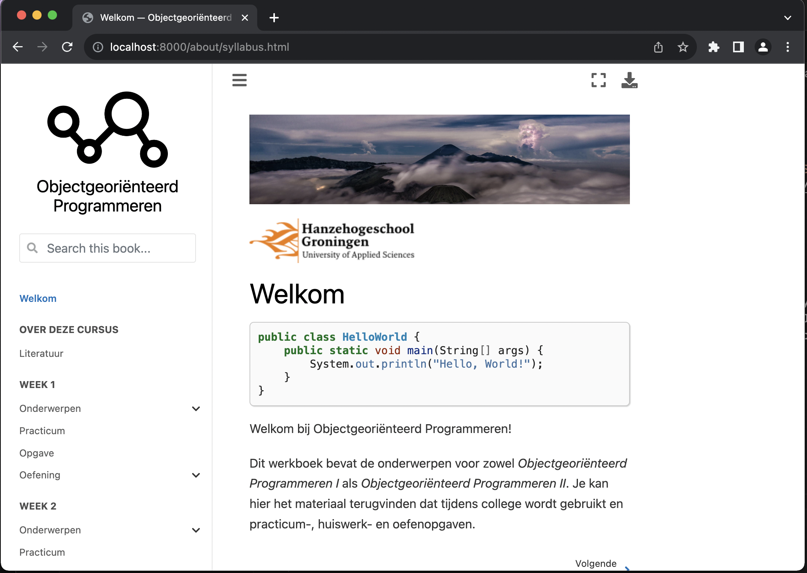

# Repository voor webtechnologie 3

## Status van deze repo
Dit is de centrale repository voor het onderwijsmateriaal voor het vak Objectgeoriënteerd Programmeren van de opleiding Software Engineering van de Hanzehogeschool Groningen. Dit materiaal is continu *work in progress*; aanpassingen, verbeteringen en aanvullingen zijn aan de orde van de dag, zeker wanneer het onderwijs een keertje heeft gedraaid. 

Samengesteld door [Bart Barnard](b.barnard@pl.hanze.nl) en [Simon van der Meer](s.van.der.meer@pl.hanze.nl).


## Opstarten

We adviseren gebruik te maken van een [virtuele omgeving](https://virtualenv.pypa.io/). Installeer de dependencies op basis van het bijgeleverde `requirements.txt`-document.

```shell
python -m pip install -r requirements.txt
```

Onafhankelijk hiervan moet je een java kernel installeren. We maken gebruik van [IJava van SpencerPark](https://github.com/SpencerPark/IJava). Bekijk [de documentatie op github](https://github.com/SpencerPark/IJava#installing) om te zien hoe je deze kernel installeert. Als het goed is kun je nu de boel bouwen:

```shell
jupyter-book build .
```

De volledige site komt nu in `_build/html` te staan. In tegenstelling tot [mkdocs]() heeft jupyter-book geen ontwikkelserver, dus het is het handigste om in deze directory een servertje op te starten (bijvoorbeeld met python, zoals hieronder), of om een `VirtualHost` te maken in je lokale apache-config. 

```shell
python -m http.server
```




## Opbouw van de notebooks

In deze repo zijn verschillende directories opgenomen. Een aantal hiervan is nodig om jupyter-book goed te laten werken en een aantal spreekt redelijk voor zich. Voor de dagelijkse gang van het onderwijs zijn de volgende drie directories met name van belang:

directory | onderdeel
----|----
topics | theorie en uitleg; fundering van de hoorcolleges
problems | opgaven die tijdens de practica moeten worden uitgevoerd en aan het begin van het hieropvolgende practicum plenair worden besproken
exercises | oefeningen die studenten in eigen tijd kunnen uitvoeren; begeleiders kunnen hier desgevraagd wel feedback op geven.

&copy;2023 Hanzehogeschool Groningen


