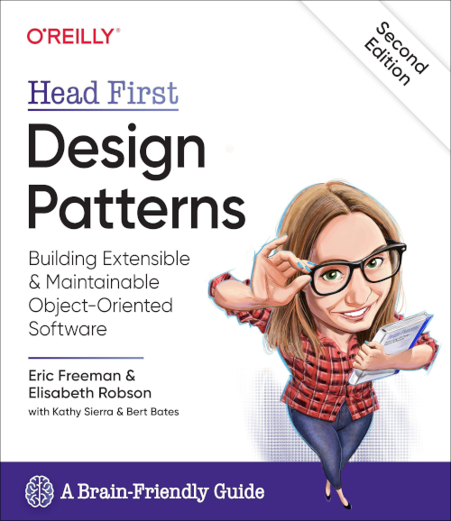

# Literatuur

Het begeleidend boek *Think Java: How to Think Like a Computer Scientist*{cite}`Downey_Allen_B_2019-12-24`. Een PDF versie van dit boek is te vinden op [https://greenteapress.com/wp/think-java-2e/](https://greenteapress.com/wp/think-java-2e/).


<!--

-->

```{bibliography}
```