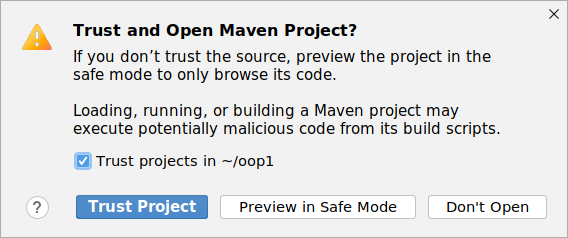
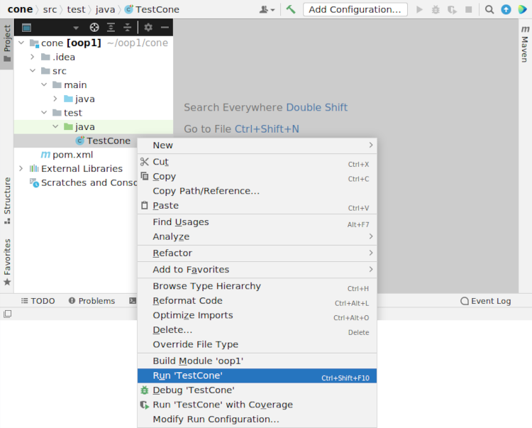
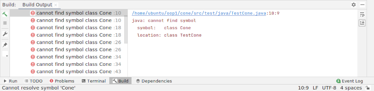
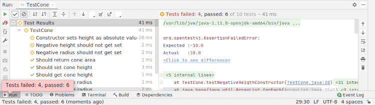
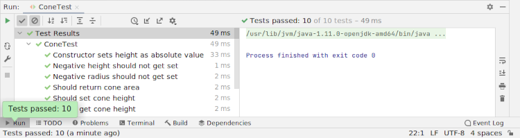

# Klassen ontwerpen en testen

Doel

-   Het ontwerpen van klassen
-   Het testen van klassen
-   Een kennismaking met *test driven development*

## Inleiding

```{figure} images/cone.png
---
name: cone
---
De dimensie van een kegel
```

In deze opgave ga je een klasse `Cone` schrijven die een kegelvormig object beschrijft. Wat de vorm van een kegel kenmerkt zijn de straal van de basis $r$ (radius) en de hoogte $h$.

## Project

Download het projectbestand <a href="../../projects/cone.zip">cone.zip</a> en pak het uit, maar lees eerst het volgende voordat je het project opent en met de opgave begint.

### Configuratie

Je gaat in deze opgave kennismaken met een directorystructuur die gebruikelijk is voor Java projecten. Het projectbestand bevat ook een [Maven](https://maven.apache.org/) configuratie (`pom.xml`) waar afhankelijkheden in zijn beschreven, bijvoorbeeld externe bibliotheken die moeten worden gebruikt en het Java versienummer waar voor gecompileerd moet worden.

Maven is een apart programma voor het helpen beheren van Java projecten en IntelliJ is bekend met Maven (het is samen met IntelliJ geïnstalleerd). IntelliJ kan jou om toestemming vragen deze Maven configuratie te importeren wanneer je het project opent:



Nadat je het project hebt geopend zal je de volgende directorystructuur zien:

```text
.
├── pom.xml
└── src
    ├── main
    │   └── java
    └── test
        └── java
            └── ConeTest.java
```

IDE's als IntelliJ moeten weten waar het je Java-bestanden kan vinden, waar het tests voor je klassen kan vinden (daar straks meer over) en waar het de gecompileerde klassen naar toe moet schrijven. IDE's zijn bekend met deze projectstructuur en IntelliJ zal met kleur aangeven welke rol eeen directory heeft:

-   

    De *source* directory is `src/main/java/`, op deze lokatie worden Java bestanden verwacht. Dit is de plek waar je `Cone.java` zal gaan schrijven.

-   

    De *test* directory is `src/main/test/`, op deze lokatie worden tests verwacht. Ook dit zijn Java bestanden, in dit project zal je een `ConeTest.java` klasse vinden.

-   

    Alle lokaties die *niet* onderdeel zijn van het project. De lokatie `target/` zal je nog niet zien, maar zodra je je klassen gaat testen of compileren, zal deze directory zichtbaar worden. Dit is de lokatie waar *gecompileerde* klassen naar toe worden geschreven. Deze worden uitgesloten omdat ze specifiek zijn voor jouw situatie (de oplossing die je op dat moment aan het uitwerken bent) in het geval dat je met meerdere mensen aan hetzelfde project werkt.

### Afhankelijkheden

Dit project maakt gebruik van een externe blibliotheek [JUnit 5](https://junit.org/junit5/). Deze afhankelijkheid is gedefinieerd in de Maven projectconfiguratie en de IDE zal het automatisch voor jou ophalen.

### Unit testing

Tot nu toe zal je methoden hebben getest door ze in `main` aan te roepen en berichten voor jezelf te printen of het resultaat correct is of niet. We gaan in deze opgave een techniek introduceren om op een meer systematische manier te testen met *[unit testing](https://en.wikipedia.org/wiki/Unit_testing)*.

Unittests definiëren waar een oplossing aan moet voldoen, het zijn  *specificaties* opgesteld in code. Dit roept een interessante vraag op over het moment van testen van een oplossing, zal dit voor- of achteraf moeten zijn? [*Test driven development*](https://tddmanifesto.com/) is een methodiek (of werkwijze) die stelt dat éérst tests moeten worden opgesteld:

> If we want to trust our code, we need to be able to trust our tests. If we want to trust our tests we need to be able to see them failing. If we never see our tests fail we don’t know if our tests are actually testing the right things. Seeing a test failing is as important as seeing it passing. A test failure validates that the test is meaningful and unique. It’s a software expectation to fulfill. It gives us a target to aim for, showing that the code we are about to implement is useful and necessary.

Het uitgangspunt van deze methode is dat hypothesen vooraf en niet achteraf moeten worden opgesteld.

Unit testing is een methode om code (klassen en de methoden van deze klassen) afzonderlijk te kunnen testen. Voor deze opgave hebben wij een unittest geschreven specifiek voor de klasse `Cone` (die nog niet is geschreven!). Als je deze klasse `ConeTest.java` leest zie je dat verwacht *gedrag* wordt getest, bijvoorbeeld:

```java
@Test
@DisplayName("Constructor sets height as absolute value")
public void testNegativeHeigthConstructor() {
    Cone c = new Cone(5.0, -10.0);

    assertEquals(c.getHeight(), 10.0);
}
```

Hier wordt aangeven dat als een nieuw `Cone` object wordt aangemaakt met een negatieve waarde voor de hoogte van de kegel dat deze waarde absoluut zal moeten worden gemaakt. Met andere woorden, negatieve waarden worden geaccepteerd (`-10.0`), maar zullen altijd moeten worden omgezet naar de positive waarde (`10.0`).

De methode `assertEquals` vergelijkt het resultaat van de aangeroepen methode met een te verwachte returnwaarde, de test slaagt indien de waarden gelijk zijn, anders faalt de test.

In deze opgave ga jij de klasse `Cone` schrijven en zal je steeds de tests in de klasse `ConeTest` uitvoeren om te zien of jouw oplossing correct is.

## Opgave

Jouw taak is het schrijven van een klasse `Cone` en je zal gebruik maken van de unittest om jouw oplossing stap voor te testen. De meest eenvoudige manier is om de klasse `ConeTest` door de IDE uit te laten voeren.



Het zal je misschien zijn opgevallen dat de klasse `ConeTest` geen `main` methode heeft, maar wél kan worden uitgevoerd! Dit is omdat IDE's JUnit kennen en de methoden in de test voor jou één voor één zullen uitvoeren.



Het uitvoeren van de tests zal een testpaneel openen met een teleurstellend resultaat. Alle tests geven de fout `cannot find symbol class Cone` en dit is omdat deze klasse nog niet is geschreven...

### De klasse `Cone`

De klasse `Cone` zal de volgende onderdelen moeten bevatten

-   Variabelen

    Dit zijn de *velden* of *properties* van de klasse, oftewel de *data*. De waarden van een kegel zijn de radius en hoogte, uit `ConeTest` kan je afleiden dat dit de namen `height` en `radius` zijn met type `double`:

    ```java
    private double height; // height of the cone
    private double radius; // radius of the circular base
    ```

    Toegang tot lezen en schrijven van deze velden zijn per conventie altijd `private` waar mee aangegeven wordt dat alleen methoden van de klasse `Cone` toegang hebben tot deze waarden.

-   Constructor(s)

    Constructors maken een nieuwe instantie van een klasse. In dit geval zal een nieuwe instantie worden gecreëerd van de klasse `Cone` met een bepaalde radius en hoogte, uit `ConeTest` kan je afleiden dat één constructor nodig is met de volgende signatuur:

    ```java
    public Cone(double radius, double height)
    ```

    Een constructor heeft altijd dezelfde naam als de klasse en heeft *geen* return type.

-   Methoden

    -   *Accessors* en *mutators*

        Een klasse kan (gecontroleerd) toegang geven tot de velden (`radius` en `height` in dit geval). Dit gaat via methoden voor het lezen (accessors) en schrijven (mutators) van deze waarden:

        ```java
        public void setHeight()   // changes the height of a cone
        public void setRadius()   // changes the radius of a cone
        public double getHeight() // returns the height of a cone
        public double getRadius() // returns the radius of a cone
        ```

    -   Andere methoden

        Los van methoden voor toegang tot de velden kunnen andere methoden gespecificeerd worden die relevant zijn, in het geval van een kegel het oppervlak en volume. Uit `ConeTest` kan je afleiden dat *twee* aanvullende methoden worden verwacht:

        ```java
        public double area()   // calculate and return the area of the cone
        public double volume() // calculate and return the volume of the cone
        ```

De klasse `Cone` ga je schrijven in de Java *source* directory van dit project, `src/main/java/`:

```{code-block} text
---
emphasize-lines: 6
---
.
├── pom.xml
└── src
    ├── main
    │   └── java
    │       └── Cone.java
    └── test
        └── java
            └── ConeTest.java
```

### Oppervlak en volume

De klasse `Cone` zal methoden moeten implementeren voor het bepalen van het oppervlak (*area*) en de inhoud (*volume*) van een kegel. Gebruik voor het bepalen van het *volume* de volgende formule

$$
V = \frac{{\pi \times r^2 \times h}}{3}
$$

en de volgende formule voor het bepalen van het *oppervlak*

$$
A = π \times r \times (r +  \sqrt{(h^2 + r^2)})
$$

### Stap voor stap

Implementeer stap voor stap de klasse, het eerste doel is om de tests uit te kunnen voeren (ongeacht of ze slagen of falen). Je zal tijd nodig hebben om de methoden `area` en `volume` uit te werken, geef in dat soort situaties om te beginnen een willekeurige `double` terug, bijvoorbeeld

```java
public double area() {
    return 0.0;
}
```

Je zal zien dat naarmate je verder komt met jouw implementatie dat sommige tests zullen slagen en andere falen.



Als je er voor hebt gezorgd dat alle tests kunnen worden uitgevoerd ga je je vervolgens concentreren op de correctheid van de methoden die je hebt geïmplementeerd, het doel is om uiteindelijk alle lichten op groen te krijgen!



### Optioneel

Implementeer een methode `toString` die een tekstrepresentatie geeft van een kegel met een bepaalde afmeting. Kies hier zelf een vorm, bijvoorbeeld `"Cone: heigth 10.0, radius: 5.0"`. Breid de klasse `ConeTest` uit met een methode die het resultaat van `toString` test, je kan ook hier de methode `assertEquals` gebruiken zoals je het in andere tests gebruikt ziet worden.

## Tot slot

In paragraaf [A.7 Testing with JUnit](https://books.trinket.io/thinkjava2/appendix-a.html#sec218) van het boek wordt JUnit kort besproken. Het voorbeeld gebruikt syntax van JUnit versie 4, wij gebruiken JUnit versie 5. Het voorbeeld dat wordt gegeven

```java
import junit.framework.TestCase;
import static org.junit.Assert.assertEquals;

public class SeriesTest extends TestCase {

    public void testFibonacci() {
        assertEquals(1, Series.fibonacci(1));
        assertEquals(1, Series.fibonacci(2));
        assertEquals(2, Series.fibonacci(3));
    }
}
```

zal voor JUnit 5 als volgt moeten worden herschreven

```java
import org.junit.jupiter.api.Test;
import static org.junit.jupiter.api.Assertions.assertEquals;

public class SeriesTest {

    @Test
    public void testFibonacci() {
        assertEquals(Series.fibonacci(1), 1);
        assertEquals(Series.fibonacci(2), 1);
        assertEquals(Series.fibonacci(3), 2);
    }
}
```

Vergelijkbaar, maar niet volledig! De import statements in Junit 5 zijn uitgebreider en met *[annotaties](https://en.wikipedia.org/wiki/Java_annotation)* wordt nu bijvoorbeeld aangegeven welke methode een test is (`@Test`). Java annotatie-syntax zullen wij in deze cursus verder *niet* behandelen, het is voornamelijk wanneer je gebruik gaat maken van JUnit 5 dat je deze syntax gaat toepassen, zie Junit 5 [documentatie](https://junit.org/junit5/docs/current/user-guide/) voor meer informatie.
