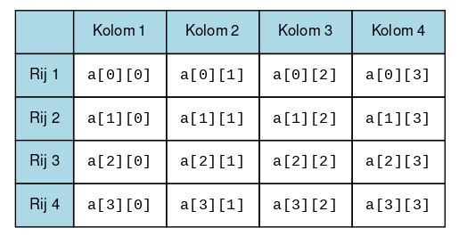
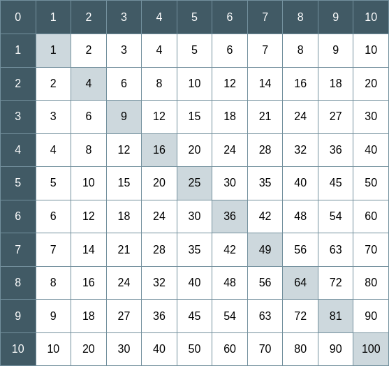

# Arrays en lussen

## Arrays

Een array is *sequentie*, een type dat meerdere elementen van een bepaald type kan bevatten. Indien je de waarden al weet, dan kan je een array van type `int` als volgt initialiseren:

```java
int[] pi = {3, 1, 4, 1, 5, 0};
```

Een waarde van een array zet je op basis van een index, bijvoorbeeld:

```java
pi[5] = 9;
```

In veel gevallen zal je de waarden van het array (nog) niet weten, maar wel de grootte en zal je een leeg array met deze grootte moeten initialiseren. Het volgende voorbeeld initialiseert een *leeg* array met 31 posities, bijvoorbeeld voor een reeks van temperaturen in een maand:

```java
double[] temp = new double[31];
```

Vervolgens kan je de waarden op basis van een index zetten, te beginnen met 0, het eerste element:

```java
temp[0] = 23.4;
temp[1] = 21.0;
temp[2] = 22.9;
...
```

Eenmaal gedefiniëerd kan een array geen andere grootte meer hebben, deze staat vast. Het is bijvoorbeeld niet meer mogelijk het uit te breiden met nieuwe waarden!

## Tweedimensionale arrays

In deze opgave introduceren we een *tweedimensionaal* array, een *array van arrays*. Dit formaat is zeer geschikt om bijvoorbeeld tabulaire data te representeren.

```{note}
Een tweedimensionaal array zal je misschien herkennen als een *list of lists*, of een `LoL`, uit de modules Programmeren I&II. Een array is niet mutable, het Python type *tuple* zal hier het dichtst bij in de buurt komt, dus zie een tweedimensionaal array als een *tuple of tuples*.
```

Om het voorbeeld van een reeks temperaturen verder te volgen zouden we op deze manier meerdere reeksen kunnen representeren, bijvoorbeeld per maand:

```java
double[][] = new double[12][31];
```

We geven hier aan dat we een nieuw array initialiseren met 12 posities, waar elke positie een `double[]` array zal moeten zijn met 31 posities. Deze structuur zou je als volgt kunnen zien:

```python
[
    [3.6, 7.3, 6.2, 4.3, ..., 3.3],   # januari
    [-2.6, 1.1, 1.4, 0.0, ..., 4.2],  # februari
    [7.2, 5,1, 7,3, 8.7, ..., 12.3],  # maart
    ...
]
```

Het ophalen van waarden volgt hetzelfde patroon als een enkelvoudig array. Bijvoorbeeld, om van het eerste element (de eerste maand, januari) de eerste waarde (meting op 1 januari) op te halen zal de syntax als volgt zijn:

```java
int newYearsDayTemp = temp[0][0];
```

En voor de laatste dag van het jaar:

```java
int newYearsEveTemp = temp[12][31];
```

Dit patroon volg je ook voor het *zetten* van waarden, bijvoorbeeld:

```java
temp[3][1] = -42  // 1 april!
```

Tot slot zie je hier samengevat hoe je de verschillende posities in een tweedimensionaal array kan benaderen. Raak hier mee bekend, want je gaat deze structuur gebruiken in de volgende opgave.



## Opgave

Een vermenigvuldigingstabel ziet er als volgt uit


Met een vermenigvuldigingstabel kan het resultaat van een vermenigvuldiging worden opgezocht, bijvoorbeeld om het resultaat van 4 x 4 op te zoeken kijk je waar de kolommen en rijen elkaar kruisen op positie 4 (dit is 16).

In deze opgave ga je een vermenigvuldigingstabel schrijven waar de tabel zowel een tekst- als een webweergave (HTML) heeft.

-   Maak om de beginnen een klasse `MulTable` met een `main` methode.

### Functionaliteit

Jouw oplossing zal aan het volgende moeten voldoen:

-   In tegenstelling tot het boverstaande voorbeeld zal jouw vermenigvuldigingstabel als *eerste* rij en *eerste* kolom moeten aangeven om welk getal het gaat, bijvoorbeeld:

    ```text
      0   1   2   3   4   5   6   7   8   9  10
      1   1   2   3   4   5   6   7   8   9  10
      2   2   4   6   8  10  12  14  16  18  20
      3   3   6   9  12  15  18  21  24  27  30
      4   4   8  12  16  20  24  28  32  36  40
      5   5  10  15  20  25  30  35  40  45  50
      6   6  12  18  24  30  36  42  48  54  60
      7   7  14  21  28  35  42  49  56  63  70
      8   8  16  24  32  40  48  56  64  72  80
      9   9  18  27  36  45  54  63  72  81  90
     10  10  20  30  40  50  60  70  80  90 100
    ```

-   Jouw programma accepteert twee argumenten, het eerste is een heel getal dat aangeeft wat de grootte van de tabel moet zijn (bijvoorbeeld 10 zal een 10 x 10 tabel geven). De tweede waarde is een zogenaamde vlag, in dit geval een *optionele* waarde `-html` die aangeeft dat de uitvoer in HTML formaat zal moeten zijn. Als deze vlag afwezig is dat is dan geef je standaard een tekstuitvoer. Bijvoorbeeld, het volgende zal HTML uitvoer geven:

    ```console
    > java MulTable.java 10 -html
    ```

-   Als geen argumenten worden gegeven toon je een kort bericht voor de gebruiker:

    ```console
    > java MulTable.java
    Sample usage:
    java Multable.java 10 [-html]
    ```

## Stap 1: de tabel

Schrijf een methode `createTable` met de volgende signatuur:

```java
public static int[][] createTable(int size)
```

Deze methode geeft een `int[][]` terug en is het resultaat van de vermenigvuldigingen voor een grootte `size`. Bijvoorbeeld, voor `size` 4 zal de stuctuur van de tabel als volgt zijn:

```java
{
    {0, 1, 2, 3, 4},
    {1, 1, 2, 3, 4},
    {2, 2, 4, 6, 8},
    {3, 3, 6, 9, 12},
    {4, 4, 8, 12, 16}
}
```

Wat opvalt is dat de uiteindelijke structuur 5 x 5 is, dus $N + 1$.

Je zal hier een *dubbele* (geneste) lus moeten schrijven waar de buitenste lus de rijen zal doorlopen en de binnenste lus de kolomwaarden voor elke rij zal moeten zetten. Je ziet hier een begin, werk dit verder uit:

```java
for (int row = 0; ...) {
    for (int column = 0; ...) {
        table[row][column] = ...;
    }
}
```

```{tip}
Lees ook de paragraaf [6.4 Nested Loops](https://books.trinket.io/thinkjava2/chapter6.html#sec75) in het boek over geneste lussen.
```

Het kan zijn dat jouw eerste resultaat vergelijkbaar is met het volgende:

```text
   0   0   0   0   0
   0   1   2   3   4
   0   2   4   6   8
   0   3   6   9  12
   0   4   8  12  16
```

In dit geval ben je goed op weg, maar het resultaat is nog niet naar wens voor de buitenste rij en kolom! Bedenk hoe je dit probleem binnen de lussen kan oplossen, je zou bijvoorbeeld kunnen controleren op bepaalde waarden van `row` en `column` en afhankelijk daarvan waarden zetten.

### Arrays printen

Je zult hebben gemerkt dat je arrays niet zomaar kan printen, er wordt standaard een niet leesbare structuur getoond die een (cryptische) verwijzing is naar een geheugenlokatie, bijvoorbeeld `[I@170e4a3d`.

Dit is het moment om tegelijkertijd verder te werken aan een methode die dit wel voor jou kan gaan doen, op naar stap 2!

## Stap 2: tekst

De standaarduitvoer van het programma is een tekstuele representatie van de vermenigvuldigingstabel. Maak daarvoor de methode `toText` met de volgende signatuur:

```java
 public static void toText(int[][] table)
```

De methode accepteert een `double[][]`, en dit is het resultaat van de methode `createTable`. Bij het maken van de tabel had je een dubbele lus nodig, en dat zal je ook hier nodig hebben voor het doorlopen van de rijen en de kolomwaarden te kunnen printen. Werk het volgende verder uit:

```java
for (int row = 0; ...) {
    for (int column = 0; ...) {
        System.out.print(table[row][column]);
    }
}
```

Het `println` statement zoals gegeven zal je moeten aanpassen, nu zal het alle waarden over alle rijen achter elkaar printen, bijvoorbeeld:

```console
> java MulTable.java 4
0000001234024680369120481216
```

Je zal dit moeten aanpassen en na elke rij een nieuwe regel moeten printen:

```console
> java MulTable.java 4
00000
01234
02468
036912
0481216
```

Je bent al goed op weg als je dit op scherm krijgt, maar het is nog niet heel netjes. Gebruik per waarde `Sytem.out.printf` om een *geformatteerde* string te maken, en gebruikt daar `%4d` voor. Dit betekent dat waarden (decimalen in dit geval) altijd worden aangevuld tot 4 karakters. Bijvoorbeeld 1 zal met spaties worden aangevuld tot `"   1"` en 100 tot `" 100"`. Op deze manier heb je in ieder geval voldoende voor tabellen met waarden tot in de honderden!

Als het goed is zal je uiteindelijk een geformatteerd resultaat krijgen:

```console
> java MulTable.java 10
   0   0   0   0   0   0   0   0   0   0   0
   0   1   2   3   4   5   6   7   8   9  10
   0   2   4   6   8  10  12  14  16  18  20
   0   3   6   9  12  15  18  21  24  27  30
   0   4   8  12  16  20  24  28  32  36  40
   0   5  10  15  20  25  30  35  40  45  50
   0   6  12  18  24  30  36  42  48  54  60
   0   7  14  21  28  35  42  49  56  63  70
   0   8  16  24  32  40  48  56  64  72  80
   0   9  18  27  36  45  54  63  72  81  90
   0  10  20  30  40  50  60  70  80  90 100
```

## Stap 3: HTML



In deze stap ga je het resultaat niet als platte tekst maar als HTML uitvoeren.

### Voorbeeld

Je kan alvast zien wat het resultaat gaan worden. Kopieer het volgende in een bestand `index.html`, dit is het resultaat van een 3 x 3 tabel.

```html
<html>
    <head>
        <link rel="stylesheet" type="text/css" href="style.css">
    </head>
    <body>
        <table>
            <tr>
                <td class="diagonal">0</td>
                <td>1</td>
                <td>2</td>
                <td>3</td>
            </tr>
            <tr>
                <td>1</td>
                <td class="diagonal">1</td>
                <td>2</td>
                <td>3</td>
            </tr>
            <tr>
                <td>2</td>
                <td>2</td>
                <td class="diagonal">4</td>
                <td>6</td>
            </tr>
            <tr>
                <td>3</td>
                <td>3</td>
                <td>6</td>
                <td class="diagonal">9</td>
            </tr>
        </table>
    </body>
</html>
```

Kopieeer en plak het volgende als `style.css` in een apart bestand (maar wel in dezelfde directory als `index.html`). Dit is een stijlbestand, want ook in de browser wil je natuurlijk een net geformatteerde tabel:

```css
body {
    margin: 5%;
}

table {
    margin: 0 auto;
    border-spacing: 0;
    border-collapse: collapse;
    font-family: Arial, Helvetica, sans-serif;
}

tr {
    height: 4vw;
}

tr:first-child td {
    color: white;
    background-color: #455A64;
}

td {
    width: 4vw;
    text-align: center;
    vertical-align: middle;
    border: 1px solid #78909C;
}

td:first-child {
    color: white;
    background-color: #455A64;
}

td:not(:first-child).diagonal {
    background-color: #cfd8dc;
}
```

Open het bestand `index.html` nu in jouw browser.

### De methode `toHtml`

Maar een methode `toHtml` aan met de volgende signatuur:

```java
public static void toHtml(int[][] table)
```

Deze methode lijkt heel erg veel op de `toText` methode, kopieer daarom ook de *body* van `toText` naar `toHtml` als een basis die je verder gaat aanpassen.

```{attention}
Je gaat ook hier *print statements* gebruiken. Het is dus niet nodig om op te zoeken hoe je vanuit jouw programma naar een bestand kan schrijven want daar hebben we een veel slimmere oplossing voor (output redirection)!
```

Als je naar het HTML voorbeeld bijkt zie je de herhalingen in de `tr` (*table row*) en `td` (*table data*) elementen waar `tr` een rij representeert en `td` elke kolomwaarde. Deze twee elementen zal je *binnen* de lus moeten printen.

*Boven* de lus print je éénmaal het *niet* variabele deel

```html
<html>
    <head>
        <link rel="stylesheet" type="text/css" href="style.css">
    </head>
    <body>
        <table>
```

en *onder* de lus het afsluitend deel:

```html
        </table>
    </body>
</html>
```

```{tip}
Bedenk dat het voor een browser niet uitmaakt of HTML wel of niet netjes is geformateerd. Bijvoorbeeld, voor een browser maakt het *niet* uit of HTML geschreven wordt als

:::{code-block} html
<tr>
    <td class="diagonal">0</td>
    <td>1</td>
    <td>2</td>
    <td>3</td>
</tr>
:::

of als:

:::{code-block} html
<tr><td class="diagonal">0</td><td>1</td><td>2</td><td>3</td></tr>
:::
```

### Output redirection

Je wilt graag jouw resultaat in een browser bekijken en de output naar `index.html` schrijven. Je kan hier gebruik maken van de functionaliteit van jouw systeem voor *input*- en *output* redirection. Om de output naar het scherm (standaard) om te leiden naar een bestand kan je het volgende gebruiken:

```console
> java MulTable.java 10 -html > index.html
```

Let op het groter dan teken `>` waarmee de output wordt weggeschreven naar het bestand `index.html`.
