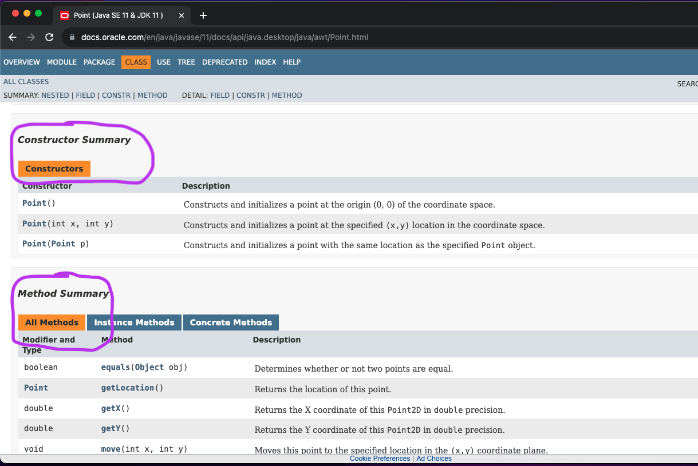

# Practicum: Objecten maken van klasse Point

Dit practicum is een kennismaking met het maken van en werken met objecten in Java.

## Klasse Point

De klasse Point representeert een punt in een twee-dimensionaal vlak.

Een object maken van een klasse wordt in de regel gedaan met het *keyword* `new``:

`<niet-primitief-type> variabele_naam = new <klasse_naam>([argumenten]);`

De onderstaande code maakt bijvoorbeeld een instantie van klasse `Point`. Een instantie (Engels: *instance*) is een object.

```{code-block} java
Point point1 = new Point();
System.out.println(point1.x + "," + point1.y);
```

Deze klasse is standaard in Java aanwezig, maar om deze klasse beschikbaar te maken dient deze geïmporteerd te worden met de volgende regel:

```{code-block} java
import java.awt.Point;
```

De import staat in de code *boven* de klasse-definitie maar *onder* de regel die begint met `package` (deze regel is niet altijd aanwezig, in dat geval staan de imports helemaal aan het begin). Een geavanceerde editor zoals IntelliJ zet de imports vaak automatisch in de code.

Maak een klasse `Practicum` met daarin een main-methode. Neem bovenstaande code over in main. Zorg ook voor de import van `Point`, door de import-regel bovenin `Practicum.java` te plaatsen. Wat zijn de coördinaten van het punt `point1`?

Coördinaten opvragen of veranderen kan door de *properties* `x` en `y` rechtstreeks te benaderen:

```{code-block} java
point1.x = 5;
point1.y = 3;
System.out.println(point1.x + "," + point1.y); // 5,3
```

Voeg bovenstaande regels code toe en test het programma.

Voeg code toe om de x-coördinaat te verhogen met 10. Print vervolgens de coördinaten op het scherm.

```{code-block} java
point1.x = point1.x + 10;
System.out.println(point1.x + "," + point1.y); // 5,3
```

De variabelen `x` en `y` zijn *properties* van *instanties* van `Point`. Properties van een object worden ook wel *instantie-variabelen* genoemd. Het rechtstreeks benaderen van instantie-variabelen van een object, buiten het object, is ongebruikelijk. Hoewel het technisch gezien kan, is binnen Java de gewoonte (conventie) om instantie-variabelen altijd te lezen of veranderen door middel van aanroep van specifieke methodes.

In de meeste klassen is het rechtstreeks benaderen van instantie-variabelen onmogelijk gemaakt. De voornaamste reden dat dit bij `Point` wel kan, is omdat deze klasse al onderdeel is van de allereerste versie van Java is, toen men wat losser omging met properties.

## Methodes

*Methodes* zijn vergelijkbaar met *functies*, maar ze zijn onderdeel van een bepaalde klasse. Ze zijn beschikbaar via een *klasse* of *object*. In dat geval wordt het begrip *methode* gebruikt in plaats van *functie*.

Voorbeeld van een *methode-aanroep* om de x-coördinaat op te vragen:

`System.out.println( point1.getX() );`

Met de methodes `getX()` en `getY()` worden de coördinaten opgevraagd. Met de methode `setLocation(int x, int y)` worden de coördinaten veranderd.

Herschrijf de code in je `main` methode, zodat de properties `x` en `y` niet meer worden gebruikt. In plaats daarvan maak je gebruik van de bovenstaande methodes.

## Constructors

Bij het maken van een instantie met keyword *new* kunnen argumenten worden meegegeven. Soms is dit verplicht, maar in het geval van `Point` niet.

Welke argumenten moeten worden meegegeven wordt gedefinieerd in de *constructor*. Soms zijn er meerdere constructors, waarbij de verschillende constructors verschillende argumenten kunnen accepteren. Dit heet *constructor overloading* en werkt net zo als *method overloading*. De klasse `Point` heeft drie constructors: `Point()`, `Point​(int x, int y)` en `Point​(Point p)`.

Voeg code toe om een tweede instantie van `Point` te maken met de naam `point2`. Geef aan de constructor de coördinaten (1,2) mee, door de argumenten 1,2 tussen haakjes te zetten achter `new Point`. Print de coördinaten op de console om te testen.

## Documentatie

Alle met Java meegeleverde klassen zijn uitvoerig gedocumenteerd. Zo is de documentatie van `Point` te vinden via [deze link](https://docs.oracle.com/en/java/javase/11/docs/api/java.desktop/java/awt/Point.html).

Onder het kopje "Constructors" vind je de *constructors*.

Onder "Method Summary" vind je een overzicht van alle methodes.



Voeg code toe om `point2` 3 plekken naar rechts en 1 naar onder te verplaatsen. Dit kan gerealiseerd worden met een combinatie van `setLocation`, `getX` en `getY`. Maar er is ook een methode die dit in één keer kan doen. Zoek in de documentatie naar deze methode en maak daar gebruik van.

Print de nieuwe coördinaten.

## Methode `toString()`

Elk object heeft de methode `toString()`. Niet elke klasse heeft een specifieke implementatie, maar als dit het geval is dan geeft `toString()` een string terug met daarin de belangrijkste informatie over een object.

Als een object op het scherm wordt afgedrukt met `System.out.println()` dan zorgt de JVM er zelf voor dat `toString()` wordt aangeroepen. Dit is ook het geval als een object aan een string wordt "geplakt" door middel van de + operator (*string concatenation*).

Probeer de regels `System.out.println(point2.toString())` en `System.out.println(point2)` uit. 

## Methodes met objecten

Objecten kunnen ook meegegeven worden aan methoden. Om precies te zijn: *verwijzingen* naar objecten kunnen meegegeven worden aan methoden. Dit zijn niet-primitieve datatypes.

Schrijf de volgende methode:

```{code-block} java
public static boolean isClose(Point p1, Point p2)
```

De methode retourneert `true` als de afstand tussen beide punten kleiner is dan 2,5. De afstand tussen twee punten wordt berekend met de stelling van Pythagoras: WORTEL((x1-x2)^2 + (y1-y1)^2)

$$
 d = \sqrt{(x1-x2)^2 + (y1-y1)^2}
$$

Gebruik de onderstaande code om je realisatie te testen:

```{code-block} java
Point point3 = new Point(2,3);
System.out.println(isClose(point3, new Point(3,3))); // true
System.out.println(isClose(point3, new Point(0,2))); // true
System.out.println(isClose(point3, new Point(0,5))); // false
```

## Foutje...

Gegeven de volgende methode:

```{code-block} java
public static Point between(Point p1, Point p2) {
        double betweenX = (p1.getX()+p2.getX()) / 2;
        double betweenY = (p1.getY()+p2.getY()) / 2;
        p1.setLocation( betweenX, betweenY );
        return p1;
}
```

De methode `between` retourneert het punt dat zich precies tussen de punten `p1` en `p2` bevindt. Coördinaten zijn altijd gehele getallen (*integers*).

Deze test suggereert er op dat de methode goed werkt:

```{code-block} java
Point point4 = new Point(5, 3);
Point point5 = new Point(15, 7);
System.out.println(between(point4, point5)); // [x=10,y=5]
```

De methode bevat echter een ernstige fout. Welke fout? Hint: Controleer na uitvoeren van de methode niet alleen naar de return-waarde, maar ook naar `point4` en `point5`...

Verbeter de fout.

## Nog een foutje...

Gegeven de volgende code:

```{code-block} java
Point player = new Point(3, 10);
Point monster = new Point(25, 10);
// De loop moet stoppen zodra de speler bij het monster is (als de coördinaten gelijk zijn)
while(player!=monster) {
   player.translate(1,0);
   System.out.println("Move.." + player);
}
System.out.println("Game over");
```

De bedoeling is dat de speler steeds een stap zet, totdat de speler bij het monster is. Dit is het geval als de coördinaten van player en monster gelijk zijn.

Test de code. De code bevat een ernstige fout. Welke?

Er zijn twee correcte manieren om de coördinaten van player en monster te vergelijken.

Ten eerste het vergelijken van zowel de x- als de y-coördinaten. Verbeter op deze wijze de fout.

Een andere manier is het vergelijken van de inhoud van de objecten. Dit lijkt te gebeuren in de gegeven code, maar dit is niet het geval. De inhoud van objecten wordt vergelijken met de `equals` methode. Verbeter de fout door gebruik te maken van de `equals` methode.

De `equals` methode is de gangbare manier om de inhoud van objecten te vergelijken. Wat exact wordt vergeleken, hangt af van de klasse. Net als `toString()` is de methode `equals` altijd aanwezig, maar het verschilt per klasse of deze volledig is geïmplementeerd.


