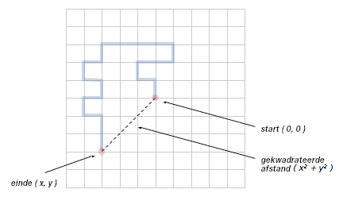

# Condities en lussen

## Doel

*   Jouw inzicht in lussen, conditionele statements en arrays verdiepen
*   Leren hoe code te debuggen

## Inleiding

Net als bij de eerste opdracht moet je de project zip <a href="../projects/loops.zip">loops.zip</a> downloaden en uitpakken. Deze zip bevat de bestanden die je voor deze opdracht nodig hebt.

## Opdracht

-   Implementeer de volgende *vier* programma's:

    *   `Bits.java`
    *   `NoonSnooze.java`
    *   `RandomWalker.java`
    *   `RandomWalkers.java`

-   Het volgende programma is een **optionele** uitdaging:

    *   `DeluxeNoonSnooze.java`

<!--
-   Submit a `readme.txt`.

-   Review this week’s coding style goals in the [COS 126 Style Guide](https://www.google.com/url?q=http://bit.ly/126StyleGuideS2021&sa=D&source=editors&ust=1621731125793000&usg=AOvVaw3VBB4D7MG6PIaYr96_8KFw).
-->

### `Bits.java`

Schrijf een programma `Bits.java` dat een integer command-line argument `n` accepteert en een `while` loop gebruikt om het aantal keren te berekenen dat je `n` door 2 moet delen totdat het strikt kleiner is dan 1. Print de foutmelding **`Illegal input`** als `n` negatief is.

```{note}
Dit programma berekent het aantal bits in de binaire representatie van n, dat ook gelijk is aan $1 + \operatorname{\mathit{floor}}(log_{2}n)$ als $n$ positief is. Deze grootheid komt voor in de informatietheorie en de analyse van algoritmen.
```

Voorbeelden:

```console
> java Bits.java 0
0

> java Bits.java 1
1

> java Bits.java 2
2

> java Bits.java 4
3

> java Bits.java 8
4

> java Bits.java 16
5

> java Bits.java 1000
10

> java Bits.java -23
Illegal input
```

### `NoonSnooze.java`

Schrijf een programma `NoonSnooze.java` dat een integer command-line argument `snooze` accepteert dat het aantal minuten weergeeft dat verstreken is sinds 12:00pm (middag) en de resulterende tijd afdrukt. Ga uit van een 12-uurs klok (met 'am' en 'pm'). **Je mag geen lussen gebruiken**. Je mag aannemen dat de waarde van `snooze` een niet-negatief geheel getal is.

```{tip}
*   Gebruik de integer deling (`/`) en modulo (`%`) operatoren om nieuwe waarden te berekenen voor uren en minuten.
*   Gebruik de modulo (`%`) operator om te bepalen of de klok 'am' of 'pm' moet weergeven.
*   Gebruik conditionele statements (`if`) om de output te helpen formatteren.
```

```{tip}
Probeer dit probleem eerst met de hand op te lossen. Bijvoorbeeld, gebruik de volgende waarden voor `snooze`: 0, 9, 15, 60, 719, 720, 721, 1440, 1441, ..., 5039, 5040, 5041, etc.. Gebruik alleen integer deling (`/`) en modulo (`%`).
```

Voorbeelden:

```console
> java NoonSnooze.java 50
12:50pm

> java NoonSnooze.java 100
1:40pm

> java NoonSnooze.java 721
12:01am

> java NoonSnooze.java 11111
5:11am
```

### `DeluxeNoonSnooze.java`

**Dit is een optionele opgave**

Dit programma, `DeluxeNoonSnooze.java`, voert dezelfde bewerking uit als `NoonSnooze.java`. Het accepteert een command-line argument `snooze` dat de verstreken minuten sinds 12:00pm (middag) aangeeft en drukt de resulterende tijd af. De **uitdaging** is om `DeluxeNoonSnooze.java` te implementeren zonder gebruik te maken van `if` statements. Bovendien moet het in staat zijn om negatieve `snooze` waarden te verwerken.

<!--
Note: the Checkstyle will flag the use of if statements as an ERROR. Since this is a challenge, you may not ask for debugging help from COS 126 staff or the lab TAs.
-->

### `RandomWalker.java`

Een drone begint vanaf Zernikeplein 11 (ZP11) doelloos rond te vliegen. Bij elke stap in tijd vliegt de drone steeds een meter in een willekeurige richting (noord, oost, zuid of west), en steeds met een kans van 25%. Hoe ver zal de drone van ZP11 zijn na `n` stappen? Dit proces staat bekend als een tweedimensionale *random walk*.



Schrijf een programma `RandomWalker.java` dat een integer command-line argument `n` accepteert en de beweging van een willekeurige wandeling voor `n` stappen simuleert. Print de locatie bij elke stap (inclusief het startpunt), waarbij het startpunt wordt gezien als de oorsprong (0, 0). Druk tenslotte het kwadraat af van de uiteindelijke Euclidische afstand tot het begin als $(x^2 + y^2)$.

Voorbeelden:

```console
> java RandomWalker.java 10
(0, 0)
(0, -1)
(0, 0)
(0, 1)
(0, 2)
(-1, 2)
(-2, 2)
(-2, 1)
(-1, 1)
(-2, 1)
(-3, 1)
gekwadrateerde afstand = 10
```

```console
> java RandomWalker.java 20
(0, 0)
(0, 1)
(-1, 1)
(-1, 2)
(0, 2)
(1, 2)
(1, 3)
(0, 3)
(-1, 3)
(-2, 3)
(-3, 3)
(-3, 2)
(-4, 2)
(-4, 1)
(-3, 1)
(-3, 0)
(-4, 0)
(-4, -1)
(-3, -1)
(-3, -2)
(-3, -3)
gekwadrateerde afstand = 18
```

````{tip}
Denk eerst na over welke variabelen je moet bijhouden. Je zal zeker het command-line argument `n` moeten omzetten naar het juiste type en bewaren. Je moet ook de huidige locatie (x, y) van de random walker opslaan. Wat moet het type zijn van de variabelen x en y? Wat moeten hun beginwaarden zijn?

Gebruik de Java module `java.uitl.Random` voor het kiezen van een willekeurig geheel getal binnen een gegeven bereik, in dit geval getallen die de vier richtingen kunnen representeren.
````

### `RandomWalkers.java`

Schrijf een programma `RandomWalkers.java` dat *twee* gehele command-line argumenten `n` en `trials` accepteert. Simuleer in elk van de onafhankelijke experimenten een willekeurige wandeling van `n` stappen en bereken de gekwadrateerde afstand. Geef de gemiddelde gekwadrateerde afstand (het gemiddelde van de gekwadrateerde afstanden van de experimenten).

```{note}
Dit proces is een eenvoudige versie van een natuurlijk verschijnsel dat bekend staat als een Brownse beweging. Het dient als wetenschappelijk model voor een verbazingwekkende reeks fysische processen, van de dispersie van inkt die in water vloeit, tot de vorming van polymeerketens in de chemie, tot een opeenvolging van neuronen die in de hersenen worden afgevuurd.
```

Voorbeelden:

```console
> java RandomWalkers.java 100 10000
gemiddelde gekwadrateerde afstand = 101.446

> java RandomWalkers.java 100 10000
gemiddelde gekwadrateerde afstand = 99.1674

> java RandomWalkers.java 200 1000
gemiddelde gekwadrateerde afstand = 195.75

> java RandomWalkers.java 400 2000
gemiddelde gekwadrateerde afstand = 383.12

> java RandomWalkers.java 800 5000
gemiddelde gekwadrateerde afstand = 811.8264

> java RandomWalkers.java 1600 100000
gemiddelde gekwadrateerde afstand = 1600.13064
```

```{tip}

Mogelijke stappen:

1.  Kopieer de code (in main) van `RandomWalker.java` naar `RandomWalkers.java`.
2.  Bedenk welke extra variabelen je nodig hebt?
3.  Je moet zeker de command-line argumenten `n` en `trials` lezen en bewaren.
4.  Naast de huidige locatie (x, y) van de random walker, heb je een *accumulator* variabele nodig, zeg `totalSquaredDistance`, die de totale som van de gekwadrateerde afstanden tot nu toe steeds bewaart.
5.  Nest de lus in een buitenste lus die de proeven herhaalt en voeg code toe om `totalSquaredDistance` bij te werken na *elke keer* dat de buitenste lus wordt doorlopen.
```
<!--

### `readme.txt` - Analyse

Als `n` toeneemt verwachten we dat de willekeurige wandeling steeds verder van de oorsprong af komt te liggen. Maar hoeveel verder? Gebruik `RandomWalkers` om een hypothese op te stellen over hoe de gemiddelde afstand in het kwadraat groeit als functie van `n`.

Wat is de proportionele relatie tussen het aantal stappen  van de random walk en de gemiddelde gekwadrateerde afstand? Met verband bedoelen we zoiets als

$$
\text{gemiddelde gekwadrateerde afstand} = 126n^9
$$

Motiveer je antwoord kort aan de hand van computerexperimenten. Beschrijf de experimenten en noem een aantal datapunten. Geef je antwoord in je `readme.txt` bestand.

```{tip}
* Voer een reeks experimenten uit waarbij het aantal proeven vastligt, maar waarbij `n` verandert - probeer grote waarden voor `n` (bijvorbeeld 100.000)
* Voer een reeks experimenten uit waarbij `n` vast blijft, maar verander het aantal proeven - probeer grote waarden voor experimenten (bijvoorbeeld 100.000)

## Inleveren

[Stuur]() de bestanden `Bits.java`, `NoonSnooze.java`, `RandomWalker.java`, `RandomWalkers.java` en een ingevulde `readme.txt` in. Je mag ook het optionele java bestand `DeluxeNoonSnooze.java` insturen.

-->

## Extra

[Hier](https://www.cs.cmu.edu/~pattis/quotations.html) kan je een groot aantal bekende en minder bekende uitspraken vinden over leren programmeren!

---

Copyright © 1999–2021, [Robert Sedgewick](http://www.cs.princeton.edu/~rs/) en [Kevin Wayne](http://www.cs.princeton.edu/~wayne).