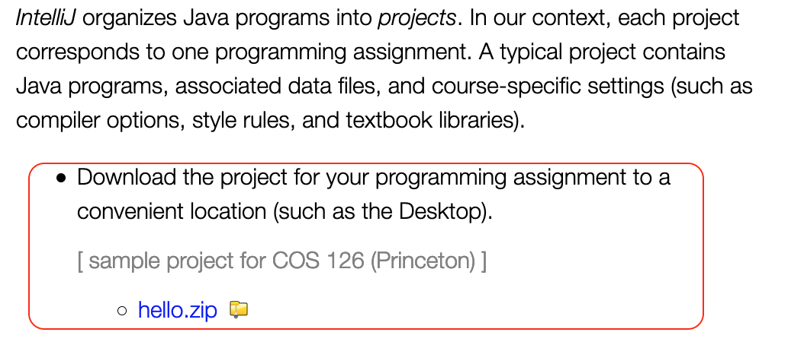
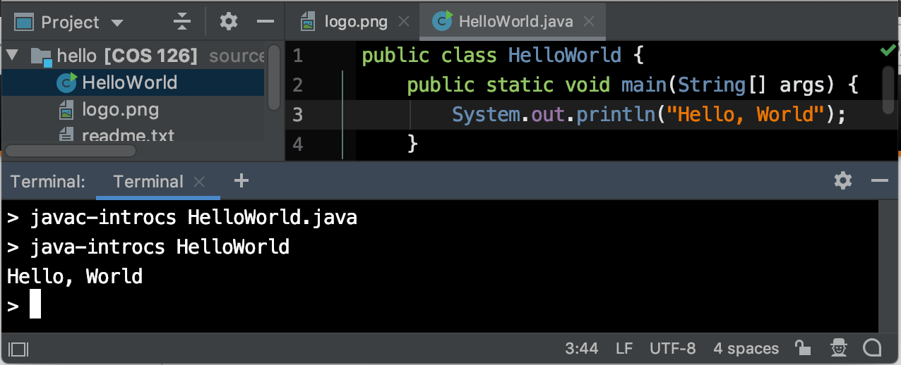
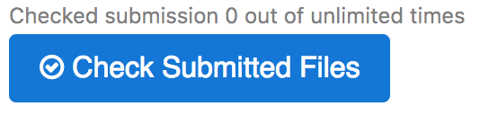

# Hello World


## Doel

-   Een eerste kennismaking met programmeren in Java
-   Het gebruiken van IntelliJ voor het schrijven, compileren uitvoeren van Java programma's
-   Het inleveren van jouw werk in GradeScope

## Inleiding

Dit is een **individuele** opdracht.

First, you must set up our Java programming environment on your computer. Follow these step-by-step instructions carefully.

*   [Mac OS X](https://lift.cs.princeton.edu/java/mac/)
*   [Windows 10](https://lift.cs.princeton.edu/java/windows/)
*   [Linux](https://lift.cs.princeton.edu/java/linux/)

Second, all assignments require that you download an IntelliJ project zip file. Use the project folder called hello that you downloaded after you installed IntelliJ. It’s a good idea to save that folder somewhere safe, along with all the folders you create for future assignments in the class. You downloaded the hello.zip project file when you installed IntelliJ:



Third, read Sections 1.1 and 1.2 of the textbook. If you don't understand something, post an Ed question or attend office hours for assistance. Don't be bashful about asking for help.

Finally, you should familiarize yourself with the [COS 126 Code Style Guide](http://bit.ly/126StyleGuideS2021).

## Implementation Tasks

### Overall Requirements

-   Implement five programs:
    *   `HelloWorld.java`
    *   `HiFour.java`
    *   `Ordered.java`
    *   `GreatCircle.java`
    *   `RGBtoCYMK.java`

-   There are two optional challenges:
    *   `DeluxeOrdered.java`
    *   `DeluxeRGBtoCYMK.java`

*   You are expected to follow these [style guidelines](https://www.cs.princeton.edu/courses/archive/spr21/cos126/assignments/faq/index.html#style) in this course.

*   Review this week’s coding style goals in the [COS 126 Style Guide](http://bit.ly/126StyleGuideS2021).

*   Submit a `readme.txt`.

### `HelloWorld.java`

Your first task is to write the `HelloWorld` program. In IntelliJ, select *File > New > Java Class*. Name the file `HelloWorld` then type in everyone's first program: `HelloWorld.java`. You can find this program at minute 10 of the ['Basic Programming Concepts' module of the first lecture](https://www.cubits.ai/collections/5/modules/7/videos/14).

You will use the `javac-introcs` and `java-introcs` commands (instead of the default `javac` and `java` commands) to compile and execute your programs. These versions provide access to our course libraries. In IntelliJ, select *LIFT > Open in Terminal*. Compile your program using the `javac-introcs` command and execute it using the `java-introcs` command:



```{note} FAQ
    **I don't understand all of the jargon in HelloWorld.java Should I drop the course?** Don't worry — you'll discover the meaning of everything in the program over the course of the term. Java needs a lot of boilerplate code to get started. Do the readings and bring any lingering questions to precept.
```

### `HiFour.java`

This exercise demonstrates the use of the String data type and command-line arguments. Write a program `HiFour.java` that takes four first names as command-line arguments and prints a proper sentence with the names in the reverse of the order given.

Examples:

```console
> java-introcs HiFour Alice Bob Carol Dave
Hi Dave, Carol, Bob, and Alice.

> java-introcs HiFour Alejandro Bahati Chandra Deshi
Hi Deshi, Chandra, Bahati, and Alejandro.
```

```{note} FAQ
When I run `HiFour`, I see the following message:

`Exception in thread "main" java.lang.ArrayIndexOutOfBoundsException: 0`

What does this mean? Did you forget to type a command-line argument when you executed the program?
```

### `Ordered.java`

This exercise demonstrates the use of the `int` and `boolean` data types. Write a program `Ordered.java` that takes three integer command-line arguments, x, y, and z. _Define_ a `boolean` variable whose value is `true` if the three values are either in strictly ascending order (x < y < z) or in strictly descending order (x > y > z), and false otherwise. Then, print this `boolean` value. You **must not** use any `if` statements.

Examples:

```console
> java-introcs Ordered 10 17 49
true

> java-introcs Ordered 49 17 10
true

> java-introcs Ordered 10 49 17
false
```

```{note} FAQ
How do I get Java to print `true` or `false` without an `if-else` statement? If b is a `boolean` variable, then `System.out.println(b)` will print `true` or `false`, according to its value.
```

### `DeluxeOrdered.java` - OPTIONAL (no extra credit)

This program, `DeluxeOrdered.java`, performs the same operation as `Ordered.java`: takes three int command-line arguments, x, y, and z, and prints `true` if the three values are either in strictly ascending order (x < y < z) or in strictly descending order (x > y > z) and `false` otherwise. The **challenge** is to implement `DeluxeOrdered.java` **without** using the four comparison operators `<`, `<=`, `>`, `>=` and `if` statements.

Note: the Checkstyle will flag the use of these constructs (comparison operators and if statements) as an ERROR. Since this is a challenge, you may not ask for debugging help from COS 126 staff or the lab TAs.

### `GreatCircle.java`

This exercise demonstrates the use of the double data type and Java’s [Math](https://introcs.cs.princeton.edu/java/11cheatsheet/#Math) library. The great circle distance is the shortest distance between two points on the surface of a sphere if you are constrained to travel along the surface. Write a program `GreatCircle.java` that takes four double command-line arguments `x1`, `y1`, `x2`, and `y2` (the latitude and longitude, in degrees, of two points on the surface of the earth) and prints the great circle distance (in nautical miles) between them. Use the following formula, which is derived from the spherical law of cosines:

$$
distance = 60 \times \arccos{(\sin{x_1} \sin{x_2} + \cos{x_1} \cos{x_2} \cos{(y_1 - y_2}))}
$$

<!--

-->

This formula uses *degrees*, whereas Java's trigonometric functions use *radians*. Use `Math.toRadians()` and `Math.toDegrees()` to convert between the two. For reference, a nautical mile (approximately 1.151 regular miles) is 1/60 of a degree of an arc along a meridian of the Earth, and this is the reason for the 60 in the formula.

Examples:

```console
> java-introcs GreatCircle 40.35 74.65 48.87 -2.33 // Princeton to Paris
3185.1779271158425 nautical miles

> java-introcs GreatCircle 48.87 -2.33 40.35 74.65 // Paris to Princeton
3185.1779271158425 nautical miles
```

```{note} FAQ
    My output for `GreatCircle` matches the sample output in the assignment specification, except in the very last digit or two. Why is there this tiny discrepancy? Is my answer wrong? Did you multiply by 60 (to convert the arc to nautical miles) before or after you converted the angle from radians to degrees? Computers work with limited precision, so algebraically equivalent formulas can produce slightly different answers. We typically ignore such tiny discrepancies when grading.
```

### `RGBtoCMYK.java`

This exercise demonstrates the use of type conversions. Several different formats are used to represent color. For example, the primary format for LCD displays, digital cameras, and web pages — known as the *RGB format* — specifies the level of red (R), green (G), and blue (B) on an integer scale from 0 to 255 inclusive. The primary format for publishing books and magazines — known as the CMYK format — specifies the level of cyan (C), magenta (M), yellow (Y), and black (K) on a real scale from 0.0 to 1.0 inclusive.

Write a program `RGBtoCMYK.java` that converts from RGB format to CMYK format. Your program must take three integer command-line arguments, red, green, and blue; print the RGB values; then print the equivalent CMYK values using the following mathematical formulas.

You **may not** use if statements on this assignment, but you may assume that the command-line arguments are not all simultaneously zero.

Recall that `Math.max(x, y)` returns the maximum of `x` and `y`.

For full credit, your programs must not only work correctly for all valid inputs, but they should be easy to read.


$$
white = \max{\left\{\frac{red}{255}, \frac{green}{255}, \frac{blue}{255}  \right\}}
$$

$$
cyan = \left( white - \frac{red}{255} \right) \div white
$$

$$
magenta = \left( white - \frac{green}{255} \right) \div white
$$

$$
yellow = \left( white - \frac{blue}{255} \right) \div white
$$

$$
black = 1 - white
$$

CMYK is a subtractive color space, because its primary colors are subtracted from white light to produce the resulting color: cyan absorbs red, magenta absorbs green, and yellow absorbs blue.

Examples:

```console
// indigo

> java-introcs RGBtoCMYK 75 0 130
red     = 75
green   = 0
blue    = 130
cyan    = 0.423076923076923
magenta = 1.0
yellow  = 0.0
black   = 0.4901960784313726

// Princeton orange

> java-introcs RGBtoCMYK 255 143 0
red     = 255
green   = 143
blue    = 0
cyan    = 0.0
magenta = 0.4392156862745098
yellow  = 1.0
black   = 0.0
```

### `DeluxeRGBtoCMYK.java` - OPTIONAL (no extra credit)

This program, `DeluxeRGBtoCMYK.java`, performs the same operation as `RGBtoCMYK.java`: converts RGB values to CMYK values. The **challenge** is to implement `RGBtoCMYK.java` **without** using `Math.max`, `Math.min`, or `if` statements.

Note: the Checkstyle will flag the use of these constructs (`Math.max`, `Math.min`, and if statements) as an ERROR. Since this is a challenge, you may not ask for debugging help from COS 126 staff or the lab TAs.

### `readme.txt`

Edit the text file named `readme.txt` that is a narrative description of your work. Each week, we provide a `readme.txt` file for you to download and use as a template, answering all questions in the space provided. Submit this file with your `.java` files.

## Submission

Before submitting the assignment, please ensure you have read the [COS 126 Style Guide](http://bit.ly/126StyleGuideS2021) and that your code follows our conventions. Style is an important component of writing code, and not following guidelines will result in deductions.

[Submit](https://tigerfile.cs.princeton.edu/COS126_S2021/Hello) HelloWorld.java, `HiFour.java`, `Ordered.java`, `GreatCircle.java`, `RGBtoCMYK.java`, and a completed `readme.txt` file via the web submission system called [TigerFile](https://tigerfile.cs.princeton.edu/COS126_S2021/Hello). You may also submit the optional java files `DeluxeOrdered.java` and `DeluxeRGBtoCMYK.java`.

Login using your OIT NetID (if necessary) and upload the specified files. Finally, click the Check All Submitted Files button:



This will compile and execute your programs, alerting you to potential problems before we grade your work. Fix any problems and resubmit. You may submit one file at a time or several files at a time. You may submit as many times as you like!

## Enrichment

Hello World in 200 Languages

Here is [Hello World](http://helloworldcollection.de) in over 200 different programming languages.
