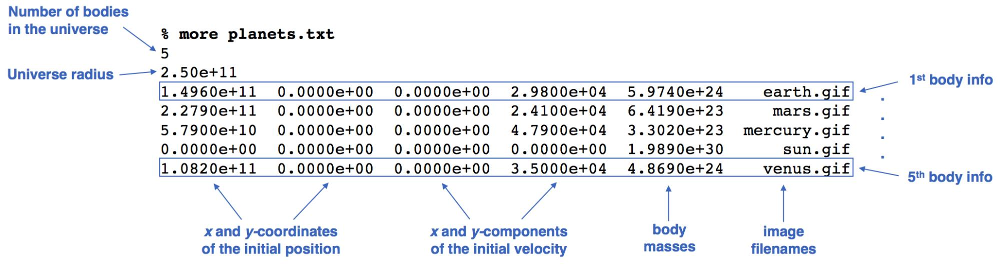
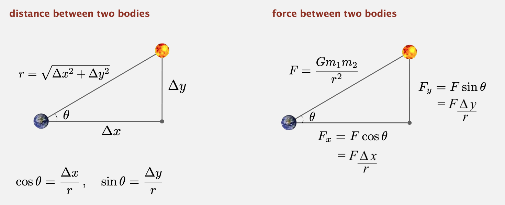

# N-Body

## Doel

-   Input leren lezen met behulp van de `StdIn` bibliotheek en geformatteerde output leren afdrukken met behulp van de `StdOut` bibliotheek.
-   Leren over graphics en animatie met behulp van de `StdDraw` bibliotheek.
-   Leren over het gebruik van de commandoregel om standaard input om te leiden naar het lezen uit een bestand.
-   Meer ervaring opdoen met arrays en loops.
-   Om te leren hoe je een groot programma in kleine, beheersbare stappen kunt ontleden

## Inleiding

Doe het volgende voordat je begint:

* **Raak vertrouwd met de command line**

* Zorg ervoor dat je de oefeningen van het practicum begrijpt.

* Download de gegevensbestanden. Om je programma te testen, heb je `planets.txt` nodig en de bijbehorende beeld- en geluidsbestanden. Download en unzip de project map <a href="../projects/nbody.zip">nbody.zip</a>, die deze bestanden bevat, inclusief extra test universums.

### Achtergrond

In deze opdracht schrijf je een programma om de beweging van `n` deeltjes (lichamen) in het vlak te simuleren, wederzijds beïnvloed door zwaartekrachten, en animeer je de resultaten.

Hier is een video [demonstratie](https://www.cs.princeton.edu/courses/archive/fall19/cos126/assignments/nbody/videos/nbody-planets.mov).

Dergelijke methoden worden op grote schaal gebruikt in de kosmologie, de halfgeleiderindustrie en de vloeistofdynamica om complexe fysische systemen te bestuderen. Wetenschappers passen dezelfde technieken ook toe op andere paarsgewijze interacties, waaronder Coulombische, Biot-Savart, en van der Waals.

In 1687 formuleerde Isaac Newton in zijn beroemde [Principia](https://en.wikipedia.org/wiki/Philosophi%25C3%25A6_Naturalis_Principia_Mathematica) de principes voor de beweging van twee deeltjes onder invloed van hun wederzijdse gravitationele aantrekkingskracht. Newton was echter niet in staat het probleem voor drie deeltjes op te lossen. In het algemeen moeten oplossingen voor stelsels van drie of meer deeltjes altijd worden benaderd via numerieke simulaties.

### Aanpak en ontwerp

**Het nabootsen van het heelal: de fysica.** We bekijken de vergelijkingen die de beweging van de deeltjes bepalen, volgens Newtons wetten van beweging en gravitatie. Maak je geen zorgen als je natuurkunde een beetje roestig is, alle noodzakelijke formules zijn hieronder opgenomen. We nemen nu aan dat de positie $(p_x, p_y)$ en de snelheid $(v_x, v_y)$ van elk deeltje bekend is. Om de dynamica van het systeem te kunnen modelleren, moeten we de netto kracht kennen die op elk deeltje wordt uitgeoefend.

*   De universele gravitatiewet van Newton stelt dat de sterkte van de gravitatiekracht tussen twee deeltjes gelijk is aan het product van hun massa's gedeeld door het kwadraat van de afstand tussen hen, geschaald door de gravitatieconstante $G$

    $$
    G = 6.67 \times 10^{-11}N \cdot m^2 \cdot kg^{-2}
    $$

    De trekkracht van een deeltje naar een ander deeltje werkt op de lijn tussen beide. Aangezien we cartesische coördinaten gebruiken om de positie van een deeltje weer te geven, is het handig om de kracht op te splitsen in zijn x- en y-componenten $(Fx, Fy)$ zoals hieronder geïllustreerd.

    ```{figure} images/image26.png
    :name: distance_force

    Afstand en kracht tussen twee lichamen
    ```

    In Java kun je de gravitatieconstante weergeven met wetenschappelijke notatie: `6.67e-11`.

-   **Netto kracht.** Het principe van superpositie zegt dat de netto kracht op een deeltje in de x- of y-richting de som is van de paarsgewijze krachten die op het deeltje in die richting werken. Het berekenen van de kracht (tussen alle paren van lichamen op tijdstip `t`) houdt in het optellen van alle paarsgewijze krachten.

    Bijvoorbeeld, de krachten op aarde (op tijdstip `t`) zijn:

    $$
    \overrightarrow{F}_{earth} = \overrightarrow{F}_{mars \rightarrow earth} + \overrightarrow{F}_{mercury \rightarrow earth} + \overrightarrow{F}_{sun \rightarrow earth} + \overrightarrow{F}_{venus \rightarrow earth}
    $$

*   **Versnelling.** De tweede bewegingswet van Newton stelt dat de versnellingen in de x- en y-richting gegeven worden door:

    $$
    a_x = \frac{F_x}{m}

    a_y = \frac{F_y}{m}
    $$

**Het universum simuleren: de numerieke deel.** We gebruiken het *eapfrog finite difference approximation scheme* om de bovenstaande vergelijkingen numeriek te integreren: dit is de basis voor de meeste astrofysische simulaties van gravitationele systemen. In het *leapfrog* schema discretiseren we de tijd, en werken we de tijdvariabele `t` bij in stappen van de *tijdmaat* $\Delta t$ (gemeten in seconden). We houden de positie $(p_x, p_y)$ en de snelheid $(v_x, v_y)$ van elk deeltje bij elke tijdstap bij. De onderstaande stappen illustreren hoe de posities en snelheden van de deeltjes evolueren.

*   **Stap A: bereken de krachten** Bereken voor elk deeltje de nettokracht $(F_x, F_y)$ op het _huidige_ tijdstip `t` die op dat deeltje werkt met behulp van de gravitatiewet van Newton en het principe van superpositie. Merk op dat de kracht een vector is (d.w.z. dat hij een richting heeft). In het bijzonder zijn $\Delta x$ en $\Delta y$ getekend (positief of negatief). Als je in het bovenstaande diagram de kracht berekent die de zon (geel-oranje) uitoefent op de aarde (donkerblauw), dan trekt de zon de aarde naar boven ($\Delta y$ positief) en naar rechts ($\Delta x$ positief). Op dezelfde manier trekt de aarde de zon naar beneden en naar links (negatieve delta x en negatieve delta y), zij het met een veel kleiner effect vanwege de aanzienlijk grotere massa van de zon.

*   **Stap B: de snelheden en posities bijwerken.** Voor elk lichaam:

    1.  Bereken de versnelling $(a_x, a_y)$ op tijdstip `t` met behulp van de in stap A berekende nettokracht en de tweede bewegingswet van Newton: $a_x = F_x / m$ and $a_y = F_y / m$.

    2.  Bereken de nieuwe snelheid $(v_x, v_y)$ bij de volgende tijdstap (tijd $t + \Delta t$) met behulp van de in (1) berekende versnelling en de snelheid uit de oude tijdstap: Ervan uitgaande dat de versnelling in dit interval constant blijft, is de nieuwe snelheid $(v_x + a_x\Delta{t}, v_y + a_y\Delta{t})$.

    3.  Bereken de nieuwe positie $(p_x, p_y)$ op tijdstip $t + \Delta t$ met behulp van de in (2) berekende snelheid en de oude positie op tijdstip t: In de veronderstelling dat de snelheid constant blijft in dit interval, is de nieuwe positie $(p_x + v_x \Delta t, p_y + v_y \Delta t)$.

*   **Stap C: teken het universum.** Teken elk deeltje, gebruik makend van de positie berekend in stap B.

Laat stappen A en B niet in elkaar overlopen, anders bereken je de krachten op tijdstip `t` met de posities van sommige deeltjes op tijdstip `t` en andere op tijdstip $t + \Delta t$. De simulatie is ook nauwkeuriger als $\Delta t$ heel klein is, maar dit gaat ten koste van meer rekenwerk.

**Een animatie maken**. Teken elk deeltje op zijn huidige positie, en herhaal dit proces bij elke tijdstap tot de aangewezen stoptijd. Door deze opeenvolging van momentopnamen (of frames) snel na elkaar weer te geven, creëer je de illusie van beweging.

## Opdracht

-   Implementeer een enkele klasse:

    -   `NBody.java`

*   Je **MOET** de opdrachtspecificaties volgen voor het lezen van input van command-line argumenten en standaard input, en het schrijven van grafische output en standaarduitvoer.

*   De twee **optionele** uitdagingen zijn:

    -   `deluxe-universe.txt`
    -   `DeluxeNBody.java`

### Specificatie

Jouw programma:

*   Accepteert twee dubbele command-line argumenten: de duur van de simulatie (*Τ*) en de simulatietijdstoename ($\Delta t$).

*   Leest informatie over het universum in van de standaard input met `StdIn`, gebruikmakend van verschillende parallelle arrays om de gegevens op te slaan.

*   Simuleert het universum, beginnend op het tijdstip *t = 0.0*, en gaat door in stappen van $\Delta t$ zolang *t < T*, gebruikmakend van het hierboven beschreven *leapfrog* schema.

*   Animeert de resultaten met `StdDraw`. Dat wil zeggen, voor elke tijdstap wordt de afbeelding van elke planeet getekend.

*   Nadat de simulatie is voltooid (tijd *T* bereikt), drukt het de toestand van het universum aan het eind van de simulatie af (in hetzelfde formaat als het invoerbestand) naar de standaarduitvoer met behulp van `StdOut`.

### Jouw programma compileren en uitvoeren

<!-- TODO uitvoeren met java met zetten van classpath -->

To compile your program from the command line, type the following in your embedded terminal:

Typ het volgend om jouw programma vanaf de command line te compileren:

```console
> javac-introcs NBody.java
```

Typ het volgende om jou programma vanaf de command line uit te voeren, waarbij het bestand `planets.txt` wordt omgeleid naar de standaard input:

```console
> java-introcs NBody 157788000.0 25000.0 < planets.txt
```

Nadat de animatie is gestopt, moet jouw programma de uiteindelijke toestand van het universum in hetzelfde formaat als de invoer uitvoeren.

## Mogelijke stappen

De sleutel tot het samenstellen van een groot programma is het eerst te ontbinden in kleinere stappen die incrementeel kunnen worden uitgevoerd en getest. Hier is de *decompositie* die wij aanbevelen voor deze opdracht:

1.  Begin met commentaar
2.  Lees de command-line argumenten
3.  Lees het universum van standaard input
4.  Initialiseer de standaard drawing
5.  Speel muziek op standaard audio
6.  Simuleer het universum (de programma lus)

Vervolgens:

1.  Bereken netto krachten
2.  Werk snelheden en posities bij
3.  Teken universum naar standaard drawing

En tot slot:

1.  Print het universum naar standaard output

Dit is de volgorde waarin de componenten in je code zullen verschijnen. Hoewel uiteindelijke jouw code zal verschijnen in de volgorde 1-6, raden wij aan deze stappen uit te voeren in de volgorde 0, 1, 2, 6, 3, 4, 5, 5B, 5C, 5A. Waarom? Omdat deze volgorde het testen en debuggen zal vergemakkelijken en we gaan deze stappen nu met jou doornemen.

### Stap 0: Begin met commentaar

*   Deze stappen zullen je helpen jouw programma te organiseren.

    ```java
    // Stap 1. Lees de command-line argumenten.

    // Stap 2. Lees het universum van standaard input.

    // Stap 3. Initialiseer de standaard drawing.

    // Stap 4. Speel muziek op standaard audio.

    // Stap 5. Simuleer het universum.

    // Stap 5A. Bereken netto krachten.

    // Stap 5B. Werk snelheden en posities bij.

    // Stap 5C. Teken universum naar standaard drawing.

    // Stap 6. Print het universum naar standaard output.
    ```

### Stap 1: Lees de command-line argumenten

*   Lees de twee command-line argumenten *Τ* en $\Delta t$ en sla hun waarden op met een correct type. Noem het eerste command-line argument `tau` of `stoppingTime` aangezien je een Java variabele naam niet met een hoofdletter moet beginnen (dit is een *conventie*, een afspraak onder Java gebruikers).

*   Print de variabelen om er zeker van te zijn dat je ze correct hebt gelezen (en in de opgegeven volgorde).  Bijvoorbeeld:

    ```console
    > java-introcs NBody 10 1
    T = 10
    dt = 1.0
    ```

    ```console
    > java-introcs NBody 157788000.0 25000.0 < planets.txt
    T = 1.57788E8
    dt = 25000.0
    ```

*   Verwijder de print statements nadat je hebt bevestigd dat je de command-line argumenten correct hebt ingelezen.

### Stap 2: Lees het universum van standaard input

*   Het invoerformaat is een tekstbestand dat informatie bevat voor een bepaald universum.

    *   De eerste waarde is een geheel getal *n* dat het aantal deeltjes weergeeft.
    *   De tweede waarde is een reëel getal *radius* dat de radius van het universum voorstelt; het wordt gebruikt om de schaling van het tekenvenster te bepalen.
    *   Vervolgens zijn er *n* lijnen, één per partikel.

        *   De eerste twee waarden zijn de x- en y-coördinaten van de beginpositie.
        *   De volgende twee waarden zijn de x- en y-componenten van de beginsnelheid.
        *   De vijfde waarde is de massa.
        *   De zesde waarde is een `String` die de naam is van een afbeelding dat wordt gebruikt om het deeltje weer te geven.

*   De rest van het bestand bevat optioneel een beschrijving van het universum die jouw programma moet negeren.

*   Bijvoorbeeld, `planets.txt` bevat echte gegevens van een deel van ons zonnestelsel.



*   Lees het aantal lichamen *n* als een `int` van standaard input.
*   Lees de straal van het universum radius als een `double` van standaardinvoer.
*   Maak zes (6) parallelle arrays, elk met lengte *n*, om de zes (6) stukjes informatie op te slaan die een lichaam karakteriseren. Laat `px[i]`, `py[i]`, `vx[i]`, `vy[i]`, en `mass[i]` `double` zijn die de huidige positie (x- en y-coördinaten), snelheid (x- en y-componenten), en massa van deeltje `i` opslaan; laat `image[i]` een `String` zijn die de bestandsnaam weergeeft van de afbeelding die gebruikt wordt om deeltje `i` weer te geven.
*   Lees data geassocieerd met elk lichaam in en sla het op in parallelle arrays.


    ```{hint}
    Recall the `Students.java` exercise from your lab.

    <!--TODO Students.java voor practicum -->

    *   Voer jouw programma uit met `planets.txt`.

        ```console
        > java-introcs NBody 157788000.0 25000.0 < planets.txt
        [geen output]
        ```
    ```

### Stap 6: Print het universum naar standaard output

*   Print het universum in het gespecificeerde formaat.
*   Onze invoer bestanden zijn gemaakt met de volgende `StdOut.printf()` statements.

    ```java
    StdOut.printf("%d\n", n);
    StdOut.printf("%.2e\n", radius);

    for (int i = 0; i < n; i++) {
        StdOut.printf("%11.4e %11.4e %11.4e %11.4e %11.4e %12s\n",
                      px[i], py[i], vx[i], vy[i], mass[i], image[i]);
    }
    ```

    Het is geen probleem om het bovenstaande fragment in jouw code te gebruiken!

*   Run your program with planets.txt. You should see exactly the output below.

*   Start je programma met `planets.txt`. Je zou precies dezelfde uitvoer als hieronder moeten zien.

    ```console
    > java-introcs NBody 0.0 25000.0 < planets.txt
    5
    2.50e+11
    1.4960e+11  0.0000e+00  0.0000e+00  2.9800e+04  5.9740e+24    earth.gif
    2.2790e+11  0.0000e+00  0.0000e+00  2.4100e+04  6.4190e+23     mars.gif
    5.7900e+10  0.0000e+00  0.0000e+00  4.7900e+04  3.3020e+23  mercury.gif
    0.0000e+00  0.0000e+00  0.0000e+00  0.0000e+00  1.9890e+30      sun.gif
    1.0820e+11  0.0000e+00  0.0000e+00  3.5000e+04  4.8690e+24    venus.gif
    ```

*   Test jouw programma met een ander bestand.

    ```console
    > java-introcs NBody 0.0 1.0 < 3body-zero-gravity.txt
    3
    5.12e+02
    0.0000e+00  0.0000e+00  1.0000e+00  1.0000e+00  1.0000e-30    earth.gif
    1.2800e+02  0.0000e+00  2.0000e+00  1.0000e+00  1.0000e-40    venus.gif
    0.0000e+00  1.2800e+02  1.0000e+00  2.0000e+00  1.0000e-50     mars.gif
    ```

<!--
*   Submit your code via TigerFile and click the Check Submitted Files button. If everything is correct so far (reading and printing the universe), your code should pass Tests 1–7. Do not continue to the next step until it does.
-->

### Stap 3: Initialiseer standaard drawing

```{figure} images/image29.png
:name: drawing_coordinates

Teken de coördinaten
```

*   De standaard x- en y-schaal ondersteunt coördinaten tussen 0 en 1. Stel de schaal van het standaard tekenvenster zo in dat (0, 0) in het midden is, (-radius, -radius) in de linkerbenedenhoek is, en (+radius, +radius) in de rechterbovenhoek is.

    ```{hint}
    Herinner je `StdDraw.setXscale()` en `StdDraw.setYscale()`.
    ```

* Roep `StdDraw.enableDoubleBuffering()` op om dubbele buffering in te schakelen en animatie te ondersteunen.

### Stap 4: Speel muziek op standaard audio

*   Gebruik de `StdAudio.play()` methode om de achtergrondmuziek af te spelen.
<!--
*   If you are running Windows, be sure that the audio stream that Java uses is not muted via Start \> Programs > Accessories > Multimedia > Volume Control > Wave Out.
-->

### Stap 5: Simuleer het universum (de programma lus)

*   Maak de tijdssimulatielus. Elke iteratie voert een enkele tijdstap van de simulatie uit, beginnend bij t = 0,0, en verder in stappen van $\Delta t$ zolang $t < T$. Deze code komt tussen de code waarin je de invoer leest en de code waarin je de uitvoer afdrukt.
*   Test je programma door de tijd *t* bij elke tijdstap af te drukken.

    ```console
    > java-introcs NBody 23.0 2.5 < planets.txt
    t = 0.0
    t = 2.5
    t = 5.0
    t = 7.5
    t = 10.0
    t = 12.5
    t = 15.0
    t = 17.5
    t = 20.0
    t = 22.5
    ```

    ```console
    > java-introcs NBody 25.0 2.5 < planets.txt
    t = 0.0
    t = 2.5
    t = 5.0
    t = 7.5
    t = 10.0
    t = 12.5
    t = 15.0
    t = 17.5
    t = 20.0
    t = 22.5
    ```

*   Zodra je er zeker van bent dat de tijdlus correct is, verwijder je de code die de tijd *t* bij elke tijdstap afdrukt.

**Stappen 5B, 5C, and 5A komen binnen de tijd lus.**

```{tip}
In welke volgorde moet ik deze 3 sub-stappen uitvoeren? 5B, 5C, 5A omdat het berekenen van krachten het moeilijkst is.
```

```{tip}
Kan ik stappen 5A, 5B, en 5C door elkaar gebruiken? Nee. Het is niet alleen een slecht ontwerp, maar het verpest ook de fysica: je hebt de positie van alle lichamen op tijdstip *t* nodig om de krachten tussen elk paar lichamen te berekenen, en het updaten van sommige posities naar tijdstip $t + \Delta t$ zou de krachten voor tijdstip *t* in de war sturen.
```

### Stap 5B: Werk snelheden en posities bij

* Aangezien we stap 5A nog niet hebben geïmplementeerd, zijn de krachten $F_x$ en $F_y$ 0, dus kunnen we in eerste instantie aannemen dat de versnellingen $a_x$ en $a_y$ nul zijn en dat de snelheden constant zijn.
* Schrijf een lus om de nieuwe snelheid en positie voor elk deeltje te berekenen.

* Werk de snelheid van elk lichaam bij: $v_x = v_x + a_x\Delta t$ en $v_y = v_y + a_y\Delta t$ (merk op dat voor nu $a_x$ en $a_y$ 0 zijn).
* Update de positie van elk lichaam: $p_x = p_x + v_x\Delta t$ en $p_y = p_y + v_y\Delta t$.

* Test op een kunstmatig universum, waar het gemakkelijk is om de verwachte resultaten met de hand te controleren.

    ```console
    > java-introcs NBody 1 1 < 3body-zero-gravity.txt
    3
    5.12e+02
    1.0000e+00  1.0000e+00  1.0000e+00  1.0000e+00  1.0000e-30    earth.gif
    1.3000e+02  1.0000e+00  2.0000e+00  1.0000e+00  1.0000e-40    venus.gif
    1.0000e+00  1.3000e+02  1.0000e+00  2.0000e+00  1.0000e-50     mars.gif
    ```

    ```console
    > java-introcs NBody 192 1 < 3body-zero-gravity.txt
    3
    5.12e+02
    1.9200e+02  1.9200e+02  1.0000e+00  1.0000e+00  1.0000e-30    earth.gif
    5.1200e+02  1.9200e+02  2.0000e+00  1.0000e+00  1.0000e-40    venus.gif
    1.9200e+02  5.1200e+02  1.0000e+00  2.0000e+00  1.0000e-50     mars.gif
    ```

<!--
*   Submit your code via TigerFile and click the Check Submitted Files button. If everything is correct so far (ignoring the gravitational forces and drawing), your code should pass Tests 1–10. Do not continue to the next step until it does.
-->

### Stap 5C: Teken universum naar standaard drawing

*   Teken elk deeltje op zijn huidige positie naar de standaard drawing, en herhaal dit proces bij elke tijdstap tot de aangewezen stoptijd. Door deze opeenvolging van momentopnamen (of frames) snel achter elkaar weer te geven, creëer je de illusie van beweging.
*   Teken na elke tijdstap de achtergrondafbeelding `starfield.jpg`; teken alle particles opnieuw in hun nieuwe posities; en controleer de snelheid van de animatie (ongeveer 40 frames per seconde ziet er goed uit).

* Gebruik `StdDraw.picture(x, y, filename)` om de achtergrondafbeelding `starfield.jpg` te tekenen, gecentreerd op (0, 0).
* Schrijf dan een lus om de *n* deeltjes weer te geven.
* Roep `StdDraw.show()` aan om de resultaten op het scherm te tonen.
* Roep `StdDraw.pause(20)` aan om de snelheid van de animatie te regelen.

* Start het programma met `planets.txt`. Je zou nu de [vier planeten die in een rechte lijn van het scherm af bewegen, met constante snelheid](https://www.cs.princeton.edu/~ak18/summer20/assignments/nbody/videos/NBodyZeroForces-5122.mov) moeten zien.

    ```console
    > java-introcs NBody 157788000.0 25000.0 < planets.txt
    ```

*   If the planets are [flickering](https://www.cs.princeton.edu/~ak18/summer20/assignments/nbody/videos/NBodyFlicker-6512.mov), be sure you are using double buffering, following the template in [BouncingBallsDeluxe.java](https://www.cs.princeton.edu/~ak18/summer20/precepts/p5b-stddraw/sol/BouncingBallsDeluxe.java). In particular, call StdDraw.enableDoubleBuffering() once at the beginning of the program, and call StdDraw.show() and StdDraw.pause(20) at the end of each time step (frame), not after each call to StdDraw.picture().
*   Run your program on another input file, such as `kaleidoscope.txt`, which produces [this animation](https://www.cs.princeton.edu/~ak18/summer20/assignments/nbody/videos/KaleidoscopeZeroForces.mov).

---

* Als de planeten [flikkeren](https://www.cs.princeton.edu/~ak18/summer20/assignments/nbody/videos/NBodyFlicker-6512.mov), wees er dan zeker van dat je dubbele buffering gebruikt, volgens het sjabloon in [BouncingBallsDeluxe.java](https://www.cs.princeton.edu/~ak18/summer20/precepts/p5b-stddraw/sol/BouncingBallsDeluxe.java). In het bijzonder, roep `StdDraw.enableDoubleBuffering()` eenmaal op aan het begin van het programma, en roep `StdDraw.show()` en `StdDraw.pause(20)` op aan het einde van elke tijdstap (frame), niet na elke aanroep van `StdDraw.picture()`.
* Voer je programma uit op een ander invoerbestand, zoals `kaleidoscope.txt`, dat [deze animatie](https://www.cs.princeton.edu/~ak18/summer20/assignments/nbody/videos/KaleidoscopeZeroForces.mov) produceert.

<!--TODO BouncingBallsDeluxe.java voor practicum -->

    ```console
    > java-introcs NBody 157788000.0 25000.0 < kaleidoscope.txt
    ```

<!--
*   Submit your code via TigerFile and click the Check Submitted Files button. If everything is correct so far (ignoring the gravitational forces), your code should pass Tests 1–17. Do not continue to the next step until it does.
-->

### Stap 5A: Bereken de krachten

* Deze stap is de moeilijkste om uit te voeren. Laten we eens kijken:

* Paarsgewijze kracht. Herinner je dit diagram van hierboven:



* Netto kracht. Het principe van superpositie zegt dat de netto kracht die op een deeltje in de x- of y-richting werkt, de som is van de paarsgewijze krachten die op het deeltje in die richting werken. Voor de berekening van de kracht (tussen alle paren van lichamen op tijdstip *t*) moeten alle paarsgewijze krachten worden opgeteld. Bijvoorbeeld, de krachten op aarde (op tijdstip t) zijn:


* Om de netto kracht op elk lichaam te berekenen, heb je twee extra arrays `fx[i]` en `fy[i]` nodig om de netto kracht op lichaam `i` op te slaan.
* De netto kracht (arrays `fx[i]` en `fy[i]`) moeten bij elke tijdstap op 0 worden geïnitialiseerd.
* Schrijf twee geneste for-lussen om de netto kracht te berekenen die door lichaam `j` op lichaam `i` wordt uitgeoefend. Voeg deze waarden toe aan `fx[i]` en `fy[i]`, maar sla het geval over wanneer `i` gelijk is aan `j` (je wilt niet de kracht van lichaam `i` op zichzelf berekenen).

````{tip}
Kun je, voordat je de netto krachten berekent, twee geneste lussen schrijven die alle paren van lichamen opsommen? Bijvoorbeeld: welke paren worden niet afgedrukt?

```console
n = 4
0-1 0-2 0-3
1-0 1-2 1-3
2-0 2-1 2-3
3-0 3-1 3-2
```

```console
n = 5
0-1 0-2 0-3 0-4
1-0 1-2 1-3 1-4
2-0 2-1 2-3 2-4
3-0 3-1 3-2 3-4
4-0 4-1 4-2 4-3
```
````

* Zodra je deze waarden hebt berekend, ga je terug naar stap 5B en gebruik je ze om de versnelling te berekenen (in plaats van aan te nemen dat die nul is).

* Bereken de versnelling $(a_x, a_y)$ op tijdstip *t* met behulp van de in stap 5A berekende nettokracht en de tweede bewegingswet van Newton: $a_x = F_x / m$ en $a_y = F_y / m$.
* De code van stap 5B zou dan de nieuwe snelheden en posities moeten berekenen.

* Test je programma op verschillende gegevensbestanden.

<!--
*   Submit your code via TigerFile and click the Check Submitted Files button. Your code should now pass all of the tests!
-->

## Debuggen

Checkstyle of IntelliJ klaagt over de variabele die ik `T` heb genoemd omdat hij met een hoofdletter begint. Welke naam moet ik in plaats daarvan gebruiken? Volgens de conventie moet een variabele in Java beginnen met een kleine letter en `camelCase` gebruiken, zoals `isLeapYear`. Een constante variabele (een variabele waarvan de waarde niet verandert tijdens de uitvoering van een programma of van de ene uitvoering van het programma naar de volgende) moet beginnen met een hoofdletter en gebruik underscores om eventuele woordgrenzen te scheiden, zoals `GRAVITATIONAL_CONSTANT`. Het kan dus voorkomen dat een Java variabele naam niet altijd perfect overeenkomt met de corresponderende domein-specifieke wiskundige notatie. In dit geval zouden `tao` of `stoppingTime` prima keuzes zijn.

Waarom krijg ik een `InputMismatchException` of een `NoSuchElementException` als ik data lees met `StdIn`? `InputMismatchException` betekent dat uw programma probeert om data van het ene type te lezen, maar dat het volgende stuk data op de standaard invoer van een incompatibel type is. Bijvoorbeeld, als je `StdIn.readInt()` gebruikt en het volgende token op standard input is 3.14, dan krijg je deze foutmelding. `NoSuchElementException` betekent dat uw programma probeert om data te lezen van standaard input terwijl er geen data meer beschikbaar is van standaard input. Bijvoorbeeld, als je `StdIn.readInt()` gebruikt om twee gehele getallen te lezen, maar de standaard invoer bevat slechts een enkel geheel getal. (Dit kan ook gebeuren als je een invoerbestand, zoals `planets.txt`, wegvaagt door per ongeluk `>` te typen in plaats van `<` tijdens een redirection commando).

Mijn animatie ziet er goed uit, maar de getallen wijken een beetje af als ik de onderstaande tests volg. Wat kan de oorzaak zijn? Controleer of je de opdrachtinstructies precies hebt opgevolgd. In het bijzonder moet je aparte lussen hebben voor stap A, B en C en je moet de snelheden bijwerken vóór de posities in stap B. Controleer of je gravitatieconstante precies `6.67e-11` is zoals gegeven.

Ik teken de lichamen, maar ze verschijnen niet op het scherm. Waarom? Heb je de schaal van standaardtekenen ingesteld (`StdDraw.setXscale()` en `StdDraw.setYscale()`) om de x- en y-coördinatenstelsels zo te veranderen dat ze de natuurkundige coördinaten gebruiken in plaats van de eenheidsdoos? Omdat je het gecentreerd wilt hebben op de oorsprong met een vierkante straal van radius, moet het minimum van elke as -radius zijn en het maximum +radius.

Mijn lichamen stoten elkaar af. ([Animatie](https://www.cs.princeton.edu/~ak18/summer20/opdrachten/nbody/videos/NBodyWrongSign-5128.mov). Waarom trekken ze elkaar niet aan? Let erop dat je het teken goed hebt als je de gravitatiewet van Newton toepast: (`x[j] - x[i]`) vs. (`x[i] - x[j]`). Merk op dat $\Delta x$ en $\Delta y$ positief of negatief kunnen zijn, dus gebruik niet `Math.abs()`. Overweeg niet om de universele gravitatieconstante *G* te veranderen om je code te patchen!

Waarom verdwijnen mijn lichamen? ([Animatie](https://www.cs.princeton.edu/~ak18/summer20/assignments/nbody/videos/NBodyCutNPaste-5133.mov). Zorg ervoor dat je de juiste index variabelen gebruikt. Het is heel gemakkelijk om een `i` met een `j` te verwarren, vooral bij het kopiëren en plakken van Java statements.

## Output testen

Hier zijn onze resultaten voor een paar voorbeeldinputs.

```console
> java-introcs NBody 0.0 25000.0 < planets.txt // zero steps
5
2.50e+11
 1.4960e+11  0.0000e+00  0.0000e+00  2.9800e+04  5.9740e+24    earth.gif
 2.2790e+11  0.0000e+00  0.0000e+00  2.4100e+04  6.4190e+23     mars.gif
 5.7900e+10  0.0000e+00  0.0000e+00  4.7900e+04  3.3020e+23  mercury.gif
 0.0000e+00  0.0000e+00  0.0000e+00  0.0000e+00  1.9890e+30      sun.gif
 1.0820e+11  0.0000e+00  0.0000e+00  3.5000e+04  4.8690e+24    venus.gif
```

```console
> java-introcs NBody 25000.0 25000.0 < planets.txt // one step
5
2.50e+11
 1.4960e+11  7.4500e+08 -1.4820e+02  2.9800e+04  5.9740e+24    earth.gif
 2.2790e+11  6.0250e+08 -6.3860e+01  2.4100e+04  6.4190e+23     mars.gif
 5.7875e+10  1.1975e+09 -9.8933e+02  4.7900e+04  3.3020e+23  mercury.gif
 3.3087e+01  0.0000e+00  1.3235e-03  0.0000e+00  1.9890e+30      sun.gif
 1.0819e+11  8.7500e+08 -2.8329e+02  3.5000e+04  4.8690e+24    venus.gif
```

```console
> java-introcs NBody 50000.0 25000.0 < planets.txt // two steps
5
2.50e+11
 1.4959e+11  1.4900e+09 -2.9640e+02  2.9799e+04  5.9740e+24    earth.gif
 2.2790e+11  1.2050e+09 -1.2772e+02  2.4100e+04  6.4190e+23     mars.gif
 5.7826e+10  2.3945e+09 -1.9789e+03  4.7880e+04  3.3020e+23  mercury.gif
 9.9262e+01  2.8198e-01  2.6470e-03  1.1279e-05  1.9890e+30      sun.gif
 1.0818e+11  1.7499e+09 -5.6660e+02  3.4998e+04  4.8690e+24    venus.gif
```

```console
> java-introcs NBody 60000.0 25000.0 < planets.txt // three steps
5
2.50e+11
 1.4958e+11  2.2349e+09 -4.4460e+02  2.9798e+04  5.9740e+24    earth.gif
 2.2789e+11  1.8075e+09 -1.9158e+02  2.4099e+04  6.4190e+23     mars.gif
 5.7752e+10  3.5905e+09 -2.9682e+03  4.7839e+04  3.3020e+23  mercury.gif
 1.9852e+02  1.1280e+00  3.9705e-03  3.3841e-05  1.9890e+30      sun.gif
 1.0816e+11  2.6248e+09 -8.4989e+02  3.4993e+04  4.8690e+24    venus.gif
```

```console
> java-introcs NBody 31557600.0 25000.0 < planets.txt // one year
5
2.50e+11
 1.4959e+11 -1.6531e+09  3.2949e+02  2.9798e+04  5.9740e+24    earth.gif
-2.2153e+11 -4.9263e+10  5.1805e+03 -2.3640e+04  6.4190e+23     mars.gif
 3.4771e+10  4.5752e+10 -3.8269e+04  2.9415e+04  3.3020e+23  mercury.gif
 5.9426e+05  6.2357e+06 -5.8569e-02  1.6285e-01  1.9890e+30      sun.gif
-7.3731e+10 -7.9391e+10  2.5433e+04 -2.3973e+04  4.8690e+24    venus.gif
```

```console
// this test should take only a few seconds
// 4.294E9 is bigger than the largest int
> java-introcs NBody 4.294E9 2.147E9 < 3body.txt
3
1.25e+11
 2.1470e+12 -7.8082e-03  5.0000e+02 -3.6368e-12  5.9740e+24    earth.gif
 1.2882e+14 -1.5100e+17  3.0000e+04 -3.5165e+07  1.9890e+30      sun.gif
-1.2882e+14  1.5100e+17 -3.0000e+04  3.5165e+07  1.9890e+30      sun.gif
```

<!--
## Challenges - OPTIONAL

### Challenge #1 - `deluxe-universe.txt`

There are limitless opportunities for additional excitement and discovery in this assignment. Create an alternate universe (using the same input format). Submit the `deluxe-universe.txt` file (using the same input format) as well as any additional image files. We provide some alternative universes written by former students (e.g., `planetsparty.txt`, `twinbinaries.txt`, `chaosblossum.txt`, `galaxy.txt`, among others). To try these universes, use your `NBody.java` with a corresponding input file named deluxe-universe.txt. For example:

```console
> java-introcs NBody 157788000.0 25000.0 < deluxe-universe.txt
```

Since this is a challenge, you may not ask for design/debugging help from COS 126 staff or the lab TAs. Submit `deluxe-universe.txt` (along with any image files) and briefly explain your approach in the `readme.txt` file.

### Challenge #2 - `DeluxeNBody.java`

Design and implement a `DeluxeNBody.java` that adds other features, such as supporting elastic or inelastic collisions. Or, make the simulation three-dimensional by doing calculations for x-, y-, and z-coordinates, then using the z-coordinate to vary the sizes of the planets. Add a rocket ship that launches from one planet and has to land on another. Allow the rocket ship to exert force with the consumption of fuel.

Since this is a challenge, you may not ask for design/debugging help from COS 126 staff or the lab TAs. Submit `DeluxeNBody.java` and any input file(s); include instructions in the `readme.txt` file. Also, record a two-minute video using [loom.com](https://www.google.com/url?q=https://www.loom.com/&sa=D&source=editors&ust=1622114625672000&usg=AOvVaw3yp8enPJIwN4EMhxk3-C9U) to showcase your universe; include the link to the video along with an explanation of your approach in the `readme.txt` file.

-->

## Achtergrond

Wat is de muziek in `2001.wav`? Het is de fanfare van [Also sprach Zarathustra](https://en.wikipedia.org/wiki/Also_sprach_Zarathustra_(Richard_Strauss)) van Richard Strauss. Het werd gepopulariseerd als het belangrijkste muzikale motief in Stanley Kubrick's film uit 1968 [2001: A Space Odyssey](https://www.tcm.com/tcmdb/title/628/2001-A-Space-Odyssey/).

Ik ben natuurkundige. Waarom zou ik de *leapfrog* methode gebruiken in plaats van de formule die ik op de middelbare school afleidde? Met andere woorden, waarom gebruikt de formule voor het bijwerken van de positie de snelheid bij de bijgewerkte tijdstap in plaats van de vorige? Waarom gebruik je niet de $\frac{1}{2}{at}^2$ formule? De *leapfrog* methode is stabieler voor het integreren van Hamiltoniaanse systemen dan conventionele numerieke methoden zoals de methode van Euler of Runge-Kutta. De *leapfrog* methode is symplectisch, wat betekent dat de eigenschappen die eigen zijn aan Hamiltoniaanse systemen behouden blijven (behoud van lineair en hoekmomentum, tijd-omkeerbaarheid, en behoud van energie van de discrete Hamiltoniaan). Gewone numerieke methoden daarentegen worden dissipatief en vertonen een kwalitatief verschillend gedrag op lange termijn. De aarde zou bijvoorbeeld langzaam in een spiraal naar (of van) de zon draaien. Om deze redenen zijn symplectische methoden in de praktijk zeer populair voor n-lichaamsberekeningen. Jij vroeg het!

Hier volgt een meer volledige uitleg over hoe je de variabelen moet interpreteren. De klassieke Eulermethode werkt de positie bij met de snelheid op tijdstip *t* in plaats van met de bijgewerkte snelheid op tijdstip $t + \Delta t$. Een beter idee is om de snelheid op het middenpunt $t + \Delta t$ / 2 te gebruiken. De haasje-over methode doet dit op een slimme manier. Het handhaaft de positie en snelheid een halve tijdstap uit fase: Aan het begin van een iteratie vertegenwoordigt $(p_x, p_y)$ de positie op tijdstip t en $(v_x, v_y)$ de snelheid op tijdstip t - Δt / 2. Door de positie en snelheid op deze manier te interpreteren, gebruikt de bijgewerkte positie $(p_x + v_x\Delta t, p_y + v_y\Delta t)$ de snelheid op tijdstip $t + \Delta t$ / 2. Bijna magisch genoeg is de enige speciale zorg die nodig is om met de halve tijdstappen om te gaan het initialiseren van de snelheid van het systeem op tijdstip t = -Δt / 2 (in plaats van t = 0,0), en u kunt ervan uitgaan dat wij dit al voor u hebben gedaan. Merk ook op dat de versnelling wordt berekend op tijdstip t, zodat wij, wanneer wij de snelheid bijwerken, de versnelling op het midden van het beschouwde interval gebruiken.

Zijn er analytische oplossingen bekend voor n-lichaamssystemen? Ja, Sundman en Wang hebben globale analytische oplossingen ontwikkeld met behulp van convergente machtsreeksen. De reeksen convergeren echter zo langzaam dat ze in de praktijk niet bruikbaar zijn. Zie [The Solution of the N-body Problem](https://www.math.uvic.ca/faculty/diacu/diacuNbody.pdf) voor een korte geschiedenis van het probleem.

Wie gebruikt n-lichaamssimulaties? N-lichaamssimulaties spelen een cruciale rol in ons begrip van het heelal. Astrofysici gebruiken ze om de stellaire dynamica in het galactisch centrum, de stellaire dynamica in een bolvormige sterrenhoop, botsende melkwegstelsels en de vorming van de structuur van het heelal te bestuderen. Het sterkste bewijs dat we hebben voor het geloof dat er zich een zwart gat in het centrum van de Melkweg bevindt, komt van zeer nauwkeurige n-lichaamssimulaties. Veel van de problemen die astrofysici willen oplossen hebben miljoenen of miljarden deeltjes. Daarvoor zijn meer verfijnde rekentechnieken nodig.

Dezelfde methoden worden ook veel gebruikt in de moleculaire dynamica, behalve dat de hemellichamen worden vervangen door atomen, dat de zwaartekracht wordt vervangen door een andere kracht, en dat de haasje-over-methode de methode van Verlet wordt genoemd. Met van der Waals krachten kan de interactie-energie vervallen als $1 / {R}^6$ in plaats van een omgekeerde kwadratenwet. Af en toe moet rekening worden gehouden met 3-weg interacties, bijvoorbeeld om de covalente bindingen in diamantkristallen te verklaren. [Kepler's Orrery](http://www.art.net/~simran/GenerativeMusic/Kepler.html) gebruikt een n-lichaamssimulator om muziek te componeren en af te spelen.

Welke technieken worden gebruikt om n-lichaamssimulatie in de praktijk uit te voeren? Hier is een schat aan informatie te vinden in [n-body simulation](http://www.schlitt.net/xstar/n-body.pdf).

---

Copyright © 1999–2021, [Robert Sedgewick](http://www.cs.princeton.edu/~rs/) en [Kevin Wayne](http://www.cs.princeton.edu/~wayne).