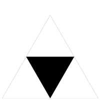

# Recursieve graphics

## Doel

* Een bibliotheek van *statische* methodes schrijven die geometrische transformaties op veelhoeken (polygonen) uitvoert.
* Een programma schrijven dat een Sierpinski driehoek tekent.
* Een programma ontwerpen en ontwikkelen dat een recursief patroon van eigen ontwerp in beeld brengt (optioneel).

<!--

## Inleiding

Read Section 2.3 of the textbook. You may also find it instructive to work through some of the other exercises and look at the solutions on the booksite afterwards. You should also familiarize yourself with the [StdDraw](https://introcs.cs.princeton.edu/java/11cheatsheet/#StdDraw) API.
-->

### Voorbereiding

Download en unzip de project zip <a href="../../projects/sierpinsky.zip">sierpinsky.zip</a>, die de bestanden bevat die je nodig hebt voor deze opdracht.

```{important}
Je gaat in deze opgave gebruik maken van de klasse `StdDraw` uit de `stdlib` bibliotheek (deze bibliotheek is opgenomen in het projectbestand).

Bij het uitvoeren van jouw programma op de command line zal je Java moeten vertellen dat je gebruik maakt van deze bibliotheek en dat Java het moet opnemen in het *classpath*. Je zal om deze reden een extra argument bij de aanroep moeten meegeven, bijvoorbeeld voor het eerste deel van deze opgave

:::{code-block} console
> java -cp lib/stdlib.jar Transform2D.java
:::

Hetzelfde zal gelden voor het tweede deel van deze opgave waar je een programma `Sierpinski.java` gaat schrijven

:::{code-block} console
> java -cp lib/stdlib.jar Sierpinski.java 4
:::
```

## Deel I - Een geometrische transformatie bibliotheek

Je zal een bibliotheek van statische methodes schrijven die verschillende geometrische transformaties uitvoert op veelhoeken. Wiskundig wordt een veelhoek gedefinieerd door de opeenvolging van hoekpunten $(x_0, y_0), (x_1, y_1), (x_2, y_2), \ldots$. In deze opgave representeren we een veelhoek door de x- en y-coördinaten van de hoekpunten op te slaan in twee *parallelle* arrays `x[]` en `y[]`. Bijvoorbeeld:

```{figure} images/image15.png
:name: draw_polygon
`StdDraw` and polygon
```

```java
// a polygon with these four vertices:
// (0, 0), (1, 0), (1, 2), (0, 1)
double x[] = { 0, 1, 1, 0 };
double y[] = { 0, 0, 2, 1 };

// Draw the polygon
StdDraw.polygon(x, y);
```

### `Transform2D.java`

Schrijf een tweedimensionale transformatie bibliotheek `Transform2D.java` door de volgende methoden te implementeren:

```java
public class Transform2D {

    // Returns a new array object that is an exact copy of the given array.
    // The given array is not mutated.
    public static double[] copy(double[] array)

    // Scales the polygon by the factor alpha.
    public static void scale(double[] x, double[] y, double alpha)

    // Translates the polygon by (dx, dy).
    public static void translate(double[] x, double[] y, double dx, double dy)

    // Rotates the polygon theta degrees counterclockwise, about the origin.
    public static void rotate(double[] x, double[] y, double theta)

    // Tests each of the methods by directly calling them.
    public static void main(String[] args)
}
```

### Requirements

*   De methoden verwachten dat de hoeken in *graden* zijn, maar Java's goniometrische functies accepteren de argumenten in *radialen*. Gebruik `Math.toRadians()` om van graden naar radialen te converteren.
*   De transformatie methoden `scale()`, `translate()`, en `rotate()` muteren de arrays, terwijl `copy()` een nieuwe array teruggeeft.
*   De hoofdmethode moet elke methode van de `Transform2D` bibliotheek testen. Met andere woorden, je moet elke `Transform2D` methode aanroepen vanuit `main`. Je moet experimenteren met verschillende gegevens, zodat je zeker weet dat je methoden correct zijn geïmplementeerd.
*   Je kunt het volgende aannemen over de invoer: de arrays doorgegeven aan `scale()`, `translate()`, en `rotate()` zijn niet `null`, hebben dezelfde lengte, en bevatten niet de waarden `NaN`, `Double.POSITIVE_INFINITY`, of `Double.NEGATIVE_INFINITY`.
*   De array die doorgegeven wordt aan `copy()` is niet `null`.
*   De waarden voor de parameters `alpha`, `theta`, `dx`, en `dy` zijn niet `NaN`, `Double.POSITIVE_INFINITY`, of `Double.NEGATIVE_INFINITY`.

### `copy()`

*Kopieert* de gegeven array in een nieuw array object. De gegeven array wordt niet gemuteerd.

De transformatie methoden (hieronder) muteren een gegeven veelhoek. Dit betekent dat de parallelle arrays die de veelhoek representeren worden veranderd door de transformatie methoden. Het is vaak nuttig om een kopie van de veelhoek op te slaan voordat een transformatie wordt toegepast.

Bijvoorbeeld:

```{figure} images/image9.png
:name: draw_copy

`StdDraw` polygon copy
```

```java
public static void main(String[] args) {
    // Set the x- and y-scale
    StdDraw.setScale(-5.0, 5.0);

    // Create original polygon
    double[] x = { 0, 1, 1, 0 };
    double[] y = { 0, 0, 2, 1 };

    // Copy original polygon
    double[] cx = copy(x);
    double[] cy = copy(y);

    // Rotate and translate the copy
    rotate(cx, cy, -45.0);
    translate(cx, cy, 1.0, 2.0);

    // Draw the copy in blue
    StdDraw.setPenColor(StdDraw.BLUE);
    StdDraw.polygon(cx, cy);

    // Draw the original polygon in red
    StdDraw.setPenColor(StdDraw.RED);
    StdDraw.polygon(x, y);
}
```

### `scale()`

*Schaalt* de coördinaten van elk punt $(x_i, y_i)$ met een factor $\alpha$.

*   $x_i^\prime = \alpha x_i$
*   $y_i^\prime = \alpha y_i$

Een voorbeeld van testcode voor `scale()` staat hieronder. We raden je echter aan om te experimenteren met verschillende **waarden** om te bevestigen dat de methoden werken zoals bedoeld.

```{figure} images/image3.png
:name: draw_scale

`StdDraw` scaled polygon
```

```java
public static void main(String[] args) {
    // Set the x- and y-scale
    StdDraw.setScale(-5.0, +5.0);

    // Create polygon
    double[] x = { 0, 1, 1, 0 };
    double[] y = { 0, 0, 2, 1 };

    // Draw original polygon in red
    StdDraw.setPenColor(StdDraw.RED);
    StdDraw.polygon(x, y);

    // Scale polygon by 2.0
    scale(x, y, 2.0);

    // Draw scaled polygon in blue
    StdDraw.setPenColor(StdDraw.BLUE);
    StdDraw.polygon(x, y);
}
```

### `translate()`

De *translatie* van elk punt $(x_i, y_i)$ met een gegeven verschuiving $(d_x, d_y)$.

*   $ x_i^\prime = x_i + d_x$
*   $ y_i^\prime = y_i + d_y$

Een voorbeeld van testcode voor `translate()` staat hieronder. We raden je echter aan om te experimenteren met verschillende waarden om te bevestigen dat jouw methode werkt zoals bedoeld.

```{figure} images/image4.png
:name: draw_translate

`StdDraw` translated polygon
```

```java
public static void main(String[] args) {
    // Set the x- and y-scale
    StdDraw.setScale(-5.0, +5.0);

    // Create polygon
    double[] x = { 0, 1, 1, 0 };
    double[] y = { 0, 0, 2, 1 };

    // Draw original polygon in red
    StdDraw.setPenColor(StdDraw.RED);
    StdDraw.polygon(x, y);

    // Translate polygon by
    // 2.0 in the x-direction
    // 1.0 in the y-direction
    translate(x, y, 2.0, 1.0);

    // Draw translated polygon in blue
    StdDraw.setPenColor(StdDraw.BLUE);
    StdDraw.polygon(x, y);
}
```

### `rotate()`

*Roteert* elk punt $(x_i, y_i)$ met $\theta$ graden tegen de klok in rond de oorsprong.

*   $x_i^\prime = x_i \cos \theta - y_i \sin \theta$
*   $y_i^\prime = y_i \cos \theta + x_i \sin \theta$

Merk op dat in de vergelijkingen $x_i^\prime$ en $y_i^\prime$ afhangen van de $x_i$ en $y_i$, respectievelijk. In je implementatie kan je best een **kopie** maken van de $x$ en $y$ arrays voor je de $x^\prime$ en $y^\prime$ arrays berekent!

Een voorbeeld van testcode voor `rotate()` staat hieronder. We raden je echter ten zeerste aan om te experimenteren met verschillende **waarden** om te bevestigen dat je methodes werken zoals bedoeld.

```{figure} images/image16.png
:name: draw_rotate

`StdDraw` rotated polygon
```

```java
public static void main(String[] args) {
    // Set the x- and y-scale
    StdDraw.setScale(-5.0, +5.0);

    // Create polygon
    double[] x = { 0, 1, 1, 0 };
    double[] y = { 0, 0, 2, 1 };

    // Draw original polygon in red
    StdDraw.setPenColor(StdDraw.RED);
    StdDraw.polygon(x, y);

    // Rotate polygon by 45 degrees ccw
    rotate(x, y, 45.0);

    // Draw rotated polygon in blue
    StdDraw.setPenColor(StdDraw.BLUE);
    StdDraw.polygon(x, y);
}
```

Een veelhoek hoeft zich niet op de oorsprong te bevinden om te kunnen roteren, je kan elke veelhoek om de oorsprong roteren met dezelfde methode. Bijvoorbeeld:


```{figure} images/image5.png
:name: draw_rotate_any

`StdDraw` rotate and draw polygon at any point
```

```java
public static void main(String[] args) {
    // Set the x- and y-scale
    StdDraw.setScale(-5.0, +5.0);

    // Create polygon
    double[] x = { 1, 2, 2, 1 };
    double[] y = { 1, 1, 3, 2 };

    // Draw original polygon in red
    StdDraw.setPenColor(StdDraw.RED);
    StdDraw.polygon(x, y);

    // Rotate polygon by 90 degrees ccw
    rotate(x, y, 90.0);

    // Draw rotated polygon in blue
    StdDraw.setPenColor(StdDraw.BLUE);
    StdDraw.polygon(x, y);
}
```

```{attention}
Let op, alle figuren die je ziet hebben coördinaten-assen, maar je zult deze niet zien als je alleen de bijgeleverde code voor tests gebruikt. Je hoeft deze assen **niet** te tekenen.
```

```{admonition} Roteren rond een willekeurig punt.
:class: tip

Hoewel de rotatie code hierboven alleen polygonen rond de oorsprong zal roteren, kan je gemakkelijk om elk ander punt $(p_x, p_y)$ roteren met een eenvoudige techniek. Vertaal eerst de polygoon met $(-p_x, -p_y)$ zodat het rotatiepunt nu op de oorsprong ligt. Gebruik vervolgens de `rotate()` functie hierboven om te roteren rond de oorsprong. Tenslotte, verplaats de polygoon terug naar het rotatie punt door eenvoudig te transleren met $(p_x, p_y)$. Boem - drie regels code, en je bent klaar! Dit kan handig zijn als je polygonen tekent in je kunstproject hieronder.
```

### `main()`

Test **elke** methode van de `Transform2D` bibliotheek door ze aan te roepen. Je moet experimenteren met verschillende waarden, zodat je er zeker van bent dat de methoden correct zijn geïmplementeerd. Voel je vrij om naar standard draw te tekenen met verschillende polygonen. Je **moet** geen command line argumenten te accepteren.

## Deel II - Sierpinski driehoek

De Sierpinski driehoek is een voorbeeld van een fractaal patroon[^ftnt1].

```{figure} images/image22.png
:name: sp_1
Sierpinski driehoek met diepte 0
```

```{figure} images/image8.png
:name: sp_1
Sierpinski driehoek met diepte 1
```

```{figure} images/image21.png
:name: sp_2
Sierpinski driehoek met diepte 2
```

```{figure} images/image20.png
:name: sp_3
Sierpinski driehoek met diepte 3

```{figure} images/image18.png
:name: sp_4
Sierpinski driehoek met diepte 4
```

```{figure} images/image12.png
:name: sp_5
Sierpinski driehoek met diepte 5
```

```{figure} images/image17.png
:name: sp_6
Sierpinski driehoek met diepte 6
```

De Poolse wiskundige Wacław Sierpiński beschreef het patroon in 1915, maar het komt al sinds de 13e eeuw voor in de Italiaanse kunst. Hoewel de Sierpinski driehoek er complex uitziet, kan het worden gegenereerd met een korte *recursieve* functie.

Jouw hoofdtaak is het schrijven van een recursieve functie `sierpinski()` die een Sierpinski driehoek van orde *n* naar standaard draw plot. Denk recursief: `sierpinski()` moet één gevulde gelijkzijdige driehoek tekenen (naar beneden gericht) en daarna zichzelf drie keer recursief aanroepen (met een passende stopconditie). Het moet 1 gevulde driehoek tekenen voor n = 1; 4 gevulde driehoeken voor n = 2; en 13 gevulde driehoeken voor n = 3; enzovoort.

### `Sierpinski.java`

Pas een modulair ontwerp toe bij het schrijven van jouw programma, door het te organiseren in vier functies, zoals gespecificeerd in de volgende methoden:

```java
public class Sierpinski {
    // Height of an equilateral triangle with the specified side length.
    public static double height(double length)

    // Draws a filled equilateral triangle with the specified side length
    // whose bottom vertex is (x, y).
    public static void filledTriangle(double x, double y, double length)

    // Draws a Sierpinski triangle of order n, such that the largest filled
    // triangle has the specified side length and bottom vertex (x, y).
    public static void sierpinski(int n, double x, double y, double length)

    // Takes an integer command-line argument n;
    // draws the outline of an upwards equilateral triangle of length 1
    // whose bottom-left vertex is (0, 0) and bottom-right vertex is (1, 0);
    // and draws a Sierpinski triangle of order n that fits inside the outline.
    public static void main(String[] args)
}
```

De formule voor de *hoogte* van een gelijkzijdige driehoek met zijde $s$ is $h = s \times \frac{\sqrt{3}}{2}$.

```{figure} images/image14.png
:name: sp_heigth
Height of an equilateral triangle of side length s
```

Hier is de indeling van de oorspronkelijke gelijkzijdige driehoek. Het bovenste punt ligt op $(\frac{1}{2}, \frac{\sqrt{3}}{2})$.

```{figure} images/image11.png
:name: sp_initial
Layout of the initial equilateral triangle
```

Hier is de indeling van een omgekeerde gelijkzijdige driehoek.

```{figure} images/image6.png
:name: sp_inverted
Layout of an inverted equilateral triangle
```

### Requirements

1.  Om een *gevulde* gelijkzijdige driehoek te tekenen, moet je de methode `StdDraw.filledPolygon()` aanroepen met de juiste argumenten.
2.  Om een *ongevulde* gelijkzijdige driehoek te tekenen, moet je de methode `StdDraw.polygon()` met de juiste argumenten aanroepen.
3.  Je moet niet `StdDraw.save()`, `StdDraw.setCanvasSize()`, `StdDraw.setXscale()`, `StdDraw.setYscale()`, of `StdDraw.setScale()` aanroepen. <!-- These method calls interfere with grading -->
4.  Je mag alle kleuren gebruiken die je wilt om de omlijnde driehoek of de gevulde driehoeken te tekenen, mits het contrasteert met de witte achtergrond.

### Mogelijke stappen

Dit zijn slechts suggesties voor hoe je gemakkelijk vooruitgang zou kunnen boeken. Je hoeft deze stappen niet te volgen. Merk op dat je uiteindelijke `Sierpinski.java` programma niet erg lang zal zijn

<!-- TODO Htree als voorbeeld/practicum
(niet langer dan `Htree.java`, commentaar en lege regels niet meegerekend).
-->

<!-- TODO verwijzing boek / practicum

-   Review [Htree.java](https://introcs.cs.princeton.edu/23recursion/Htree.java.html) from the textbook and lecture.
-->

- Schrijf een (niet recursieve) functie `height()` die de lengte van de zijde van een gelijkzijdige driehoek als argument neemt en de hoogte teruggeeft. De body van deze methode moet een one-liner zijn.

    * Test je `height()` functie. Dit betekent dat je de `height()` functie met verschillende waarden moet uitproberen. Geeft het de juiste berekening terug?

- Teken in `main()` de omtrek van de oorspronkelijke gelijkzijdige driehoek. Gebruik de `height()` functie om de hoekpunten van de driehoek te berekenen.

- Schrijf een (niet recursieve) functie `filledTriangle()` die **drie** (3) argumenten (`x`, `y`, `length`) accepteert en een gevulde gelijkzijdige driehoek tekent (met de punt naar beneden) met de opgegeven zijlengte en het onderste hoekpunt op (x, y).

    * Om je functie te testen, schrijf je `main()` zo dat `filledTriangle()` een paar keer wordt aangeroepen met verschillende argumenten. Je zult in staat zijn om deze functie zonder aanpassingen te gebruiken in `Sierpinski.java`.

-   Uiteindelijk moet je een recursieve functie `sierpinski()` schrijven die **vier** (4) argumenten (`n`, `x`, `y`, `length`) accepteert en een Sierpinski driehoek van orde *n* tekent, waarvan de grootste driehoek de opgegeven zijde lengte en onderste hoekpunt (x, y) heeft. Echter, gebruik een incrementele aanpak om deze functie te implementeren:

    * Schrijf een recursieve functie `sierpinski()` die één argument `n` accepteert, de waarde `n` afdrukt, en zichzelf dan drie keer aanroept met de waarde `n - 1`. De recursie moet stoppen als `n` 0 wordt.

    * Om je functie te testen, schrijf je `main()` zo dat het een *integer* command line argument `n` accepteert en `sierpinski(n`) aanroept. Je krijgt de volgende uitvoer als je `sierpinski()` aanroept met `n` van 0 tot 5. Zorg ervoor dat je begrijpt hoe deze functie werkt, en waarom de getallen worden afgedrukt in de volgorde waarin dat gebeurt.

        ```console
        > java -cp lib/stdlib.jar Sierpinski.java 0
        [geen output]
        ```

        ```console
        > java -cp lib/stdlib.jar Sierpinski.java 1
        1
        ```

        ```console
        > java -cp lib/stdlib.jar Sierpinski.java 2
        2
        1
        1
        1
        ```

        ```console
        > java -cp lib/stdlib.jar Sierpinski.java 3
        3
        2 1 1 1
        2 1 1 1
        2 1 1 1
        ```

        ```console
        > java -cp lib/stdlib.jar Sierpinski.java 4
        4
        3 2 1 1 1 2 1 1 1 2 1 1 1
        3 2 1 1 1 2 1 1 1 2 1 1 1
        3 2 1 1 1 2 1 1 1 2 1 1 1
        ```

        ```console
        > java -cp lib/stdlib.jar Sierpinski.java 5
        5
        4 3 2 1 1 1 2 1 1 1 2 1 1 1
          3 2 1 1 1 2 1 1 1 2 1 1 1
          3 2 1 1 1 2 1 1 1 2 1 1 1
        4 3 2 1 1 1 2 1 1 1 2 1 1 1
          3 2 1 1 1 2 1 1 1 2 1 1 1
          3 2 1 1 1 2 1 1 1 2 1 1 1
        4 3 2 1 1 1 2 1 1 1 2 1 1 1
          3 2 1 1 1 2 1 1 1 2 1 1 1
          3 2 1 1 1 2 1 1 1 2 1 1 1
        ```

    *   Wijzig `sierpinski()` zodat het niet alleen `n` afdrukt, maar ook de lengte van de te plotten driehoek. Je functie moet nu twee argumenten hebben: `n` en `length`. De eerste aanroep van `main()` moet `sierpinski(n, 0.5)` zijn, omdat de grootste Sierpinski driehoek zijde lengte 0.5 heeft. Elk opeenvolgend niveau van recursie halveert de lengte. Jouw functie zou de volgende output moeten geven:

        ```console
        > java -cp lib/stdlib.jar Sierpinski.java 0
        [geen output]
        ```

        ```console
        > java -cp lib/stdlib.jar Sierpinski.java 1
        1 0.5
        ```

        ```console
        > java -cp lib/stdlib.jar Sierpinski.java 2
        2 0.5
        1 0.25
        1 0.25
        1 0.25
        ```

        ```console
        > java -cp lib/stdlib.jar Sierpinski.java 3
        3 0.5
        2 0.25  1 0.125  1 0.125  1 0.125
        2 0.25  1 0.125  1 0.125  1 0.125
        2 0.25  1 0.125  1 0.125  1 0.125
        ```

        ```console
        > java -cp lib/stdlib.jar Sierpinski.java 4
        4 0.5
        3 0.25  2 0.125  1 0.0625  1 0.0625  1 0.0625
                2 0.125  1 0.0625  1 0.0625  1 0.0625
                2 0.125  1 0.0625  1 0.0625  1 0.0625
        3 0.25  2 0.125  1 0.0625  1 0.0625  1 0.0625
                2 0.125  1 0.0625  1 0.0625  1 0.0625
                2 0.125  1 0.0625  1 0.0625  1 0.0625
        3 0.25  2 0.125  1 0.0625  1 0.0625  1 0.0625
                2 0.125  1 0.0625  1 0.0625  1 0.0625
                2 0.125  1 0.0625  1 0.0625  1 0.0625
        ```

    * Wijzig `sierpinski()` zodat het **vier** (4) argumenten (`n`, `x`, `y`, `length`) accepteert en een Sierpinski driehoek van orde `n` tekent, waarvan de grootste driehoek de opgegeven zijde lengte en onderste hoekpunt (x, y) heeft. Begin met het tekenen van Sierpinski driehoeken met potlood en papier. Welke waarden moeten er veranderen tussen elke recursieve aanroep?

*   Verwijder tot slot alle print statements als je klaar bent.

Hieronder staan de Sierpinski-driehoeken voor verschillende waarden van `n`.

|  Input                                      | Output                  |
|---------------------------------------------|-------------------------|
| `java -cp lib/stdlib.jar Sierpinski.java 1` |   |
| `java -cp lib/stdlib.jar Sierpinski.java 2` |  |
| `java -cp lib/stdlib.jar Sierpinski.java 3` |  |

## Deel III - Maak jouw eigen kunstwerk

Dit is een **optionele** opgave.

### `Art.java`

In dit deel ga je een programma `Art.java` maken dat een recursieve tekening maakt van je eigen ontwerp. In dit deel kan je jouw creativiteit alle ruimte geven, maar hier zijn wat hints voor het geval je niet zo artistiek bent.

Een zeer goede aanpak is om eerst een recursief patroon te kiezen als doel-output. Hier kan je een aantal [inzendingen van studenten zien](https://www.cs.princeton.edu/courses/archive/fall15/cos126/art/index.php) die een vergelijkbare cursus hebben gevolgd. Zie ook de Famous Fractals in [Fractals Unleashed](https://wayback.archive-it.org/3635/20130719033956/http://library.thinkquest.org/26242/full/index.html) voor enkele ideeën. Hier is een [lijst van fractals, per Hausdorff dimensie](https://en.wikipedia.org/wiki/List_of_fractals_by_Hausdorff_dimension). Sommige plaatjes zijn moeilijker te genereren dan andere (en sommige vereisen trigonometrie).

### Requirements

1.  `Art.java` moet **één** (1) geheel command-line argument `n` accepteren dat de diepte van de recursie bepaalt.
2.  Jouw tekening **moet** binnen het tekenvenster blijven als `n` tussen 1 en 6 inclusief is. <!-- (De autograder zal geen waarden van n buiten dit bereik testen) -->
3. Je mag de grootte van het tekenvenster niet veranderen (maar je mag wel de schaal veranderen). Voeg *geen* geluid toe.
4.  Je tekening kan een geometrisch patroon zijn, een willekeurige constructie, of iets anders dat gebruik maakt van recursieve functies.
5.  Optioneel mag je de `Transform2D` bibliotheek gebruiken die je in deel 1 hebt geïmplementeerd. Je kunt ook extra geometrische transformaties definiëren in `Art.java`, zoals [lijnvermenigvuldiging](https://en.wikipedia.org/wiki/Shear_mapping), spiegeling over de x- of y-as, of roteren om een willekeurig punt (in tegenstelling tot de oorsprong).

<!--
6.  Je programma moet worden georganiseerd in ten minste drie afzonderlijke functies, inclusief `main()`. Alle functies *uitgezonderd* `main()` moeten **private** zijn.
7.  Om volledig krediet te krijgen, moet `Art.java` niet iets zijn dat gemakkelijk herschreven kan worden om lussen te gebruiken in plaats van recursie, en sommige aspecten van de recursieve functie-aanroep boom (of hoe parameters of overlapping worden gebruikt) moeten anders zijn dan de voorbeelden in de les (`HTree`, `NestedCircles`, etc.). Je moet **ten minste** twee van de volgende dingen doen om volledig krediet te krijgen voor `Art.java` (en meer doen **kan** een klein beetje extra krediet opleveren):

    * een of meer `Transform2D` methoden aanroepen
    * gebruik andere parameters dan de voorbeelden: `f(n, x, y, size)`
    * andere `StdDraw` methoden gebruiken dan de voorbeelden (b.v. ellipsen, bogen, tekst; kijk eens naar de `StdDraw` [API](https://introcs.cs.princeton.edu/java/stdlib/javadoc/StdDraw.html))
    * een niet-constant aantal recursieve aanroepen per niveau (b.v. conditionele recursie)
    * hebben wederzijds recursieve methoden
    * meerdere recursieve methodes hebben
    * recursie gebruiken die niet altijd recursief is van niveau n naar niveau n-1
    * tekenen tussen recursieve oproepen, niet alleen voor of na alle recursieve oproepen
    * gebruik recursief niveau voor secundair doel (b.v. niveau dicteert kleur)

8.  Contrasteer dit met de voorbeelden `HTree`, `Sierpinski`, en `NestedCircles`, die sterk op elkaar lijkende structuren hebben.
9.  Je verliest ook punten als je kunstwerk net zo makkelijk zonder recursie kan worden gemaakt (zoals [Factorial.java](https://introcs.cs.princeton.edu/java/23recursion/Factorial.java.html)). Als de recursieve functie-aanroep-boom voor je methode een rechte lijn is, valt hij waarschijnlijk onder deze categorie.
10.  Je mag GIF, JPG, of PNG bestanden gebruiken in mijn artistieke creatie. Als je dat doet, zorg er dan voor dat je ze samen met je andere bestanden instuurt. Maak in je readme.txt duidelijk welk deel van het ontwerp van jou is en welk deel geleend is van het afbeeldingsbestand.

Bijvoorbeeld, de [Quadricross](https://en.wikipedia.org/wiki/File:Quadriccross.gif) ziet er heel anders uit dan de klassikale voorbeelden, maar de code om het te genereren lijkt heel erg op `HTree`, dus is het een slechte keuze. Aan de andere kant, ook al genereert de [Sierpinski curve](https://www.robertdickau.com/sierpinskiarrow.html) uiteindelijk iets dat lijkt op de Sierpinski driehoek, de code is heel anders (waarschijnlijk inclusief een hoekargument in de recursieve methode), en dus zou het volledige punten verdienen.

```{warning}
**De API checker zegt dat ik mijn methodes private moet maken.** Gebruik de access modifier `private` in plaats van `public` in de method signature. Een public methode kan direct in een andere klasse worden aangeroepen, een private methode niet. De enige `public` methode die je in `Art.java` zou moeten hebben is `main()`.
```
-->

## Achtergrond

Fractals in het wild. Hier is een Sierpinski driehoek in [klei](https://www.evilmadscientist.com/article.php/fimofractals), een [Sierpinski koekje](https://www.evilmadscientist.com/article.php/fractalcookies), een [fractal pizza](https://slice.seriouseats.com/archives/2010/09/john-riepenhoffs-recursive-pizza.html), en een [Sierpinski hamantaschen](https://seattlelocalfood.com/2011/03/20/sierpinski-hamantaschen-sierpinskitaschen/).

<!--
Fractale dimensie (optionele afleiding). Op de lagere school heb je geleerd dat de dimensie van een lijnstuk 1 is, de dimensie van een vierkant 2, en de dimensie van een kubus 3. Maar je hebt waarschijnlijk niet geleerd wat er werkelijk bedoeld wordt met de term *dimensie*. Hoe kunnen we wiskundig of rekenkundig uitdrukken wat het betekent? Formeel kunnen we de *Hausdorff dimensie* of *similariteitsdimensie* van een zelfgelijkvormige figuur definiëren door de figuur te verdelen in een aantal zelfgelijkvormige stukken van kleinere omvang. We definiëren de dimensie als de log (# zelfgelijkende stukken) / log (schalingsfactor in elke ruimtelijke richting). We kunnen bijvoorbeeld het eenheidsvierkant ontbinden in vier kleinere vierkanten, elk met een zijde van 1/2; of we kunnen het ontbinden in 25 vierkanten, elk met een zijde van 1/5. Hier is het aantal zelfgelijkvormige stukken 4 (of 25) en de schalingsfactor 2 (of 5). De dimensie van een vierkant is dus 2, want log (4) / log(2) = log (25) / log (5) = 2. Verder kunnen we de eenheids kubus ontbinden in 8 kubussen, elk met zijde lengte 1/2; of we kunnen hem ontbinden in 125 kubussen, elk met zijde lengte 1/5. De dimensie van een kubus is dus log(8) / log (2) = log(125) / log(5) = 3.

We kunnen deze definitie ook direct toepassen op de (verzameling van witte punten in) Sierpinski driehoek. We kunnen de eenheidsdriehoek van Sierpinski ontbinden in drie Sierpinski-driehoeken, elk met zijde 1/2. De dimensie van een Sierpinski-driehoek is dus log (3) / log (2) ≈ 1.585. De dimensie is fractioneel - meer dan een lijnstuk, maar minder dan een vierkant! Bij Euclidische meetkunde is de dimensie altijd een geheel getal; bij fractale meetkunde kan het iets ertussenin zijn. Fractals lijken op veel fysische objecten; bijvoorbeeld de kustlijn van Groot-Brittannië lijkt op een fractal; de fractal dimensie is gemeten op ongeveer 1.25.
-->

[^ftnt1]: De Poolse wiskundige Wacław Sierpiński beschreef het patroon in 1915, maar het komt al sinds de 13e eeuw voor in de Italiaanse kunst. Hoewel de Sierpinski driehoek er complex uitziet, kan hij worden gegenereerd met een korte recursieve functie.

---

Copyright © 1999–2021, [Robert Sedgewick](http://www.cs.princeton.edu/~rs/) en [Kevin Wayne](http://www.cs.princeton.edu/~wayne).